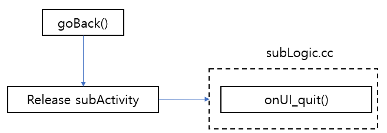

# Activity life cycle
Before introducing the activity life cycle, let's first understand the hierarchical relationship of the activity


First of all, our application will first enter the **mainActivity**, which is the startup activity, and then open the **subActivity** through the `openActivity` method, and then enter the **thirdActivity** . The hierarchical effect seen in the above figure is formed; the activity opened later is at the upper level of the hierarchy, and a relationship of **stack** is formed between them;

## Activity flow when opening
Let's take a look at the process of the program after calling the `openActivity` method. Here are two scenarios:

* **There is no** activity to be opened in the activity stack;


Let's take a look at the `onUI_init` function in **subLogic.cc**. Only when the activity does not exist in the activity stack, this function will be used when it is opened for the first time. Going here means that all the control pointers are initialized. In this function we can start to perform some operations on them, as follows:

```c++
static void onUI_init() {
	//Tips :Add the display code of UI initialization here, such as:mTextView1Ptr->setText("123");
	LOGD("sub onUI_init\n");
	mTextView1Ptr->setText("123");
}
```

Data is transferred when the interface is opened and it is received and processed in the `onUI_intent` callback function:

```c++
static void onUI_intent(const Intent *intentPtr) {
	LOGD("sub onUI_intent\n");
	// Judge not empty
	if (intentPtr) {
		// Key value analysis
		std::string cmd = intentPtr->getExtra("cmd");		// "open"
		std::string value = intentPtr->getExtra("value");	// "ok"
		......
	}
}
```
 `onUI_show` function - Activity display completion callback;

* **There is** the activity to be opened in the activity stack


In this case, only the corresponding activity in the activity stack is moved to the top level, and the ~~`onUI_init`~~ process is not followed;


<br/><br/>Opening an activity to display means that the previous top-level interface is hidden; assuming that the **subActivity** is opened in the **mainActivity** , their activity flow is as follows:


Here we focus on the **mainActivity** **hide** ------> **subActivity** **display** process;


## Activity flow when closing
When we call the `goBack()` function, the top-level activity will pop up until the activity is started;


When the activity is closed, the `onUI_quit` callback function will be called. If some resources are requested after the activity is opened, remember to release it here;



After exiting the top-level activity, the next-level activity will be displayed and will call the `onUI_show` function of the next-level activity;<br/>When we call the `goHome()` function, we will directly go back to the startup activity and pop up all other activity;


When we call the `closeActivity("xxx")` function, we can remove any activity except the startup activity; when the activity is not the top-level activity, the next-level activity will not call ~~`onUI_show`~~ function;
