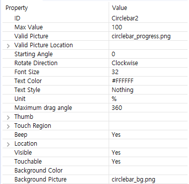

#  Circular progress bar
In some cases, we need to display a "Loading" animation. Then the circular progress bar is very suitable.

## How to use 
1. First, open the UI file, create a **circular progress bar**, and then set the **valid picture** properties. A basic circular progress bar is created.
    All its properties are as follows:

   

2. The circular progress bar essentially displays the fan-shaped area corresponding to the current progress. This area is a crop of the **valid picture**. For example:

  If the properties are set according to the above figure, the maximum value is 100, the starting angle is 0, and the rotation direction is clockwise, then when we set the progress of 25, only the 90° fan-shaped area in the upper right corner is displayed. If the progress value is 100, then all valid graphs are displayed.
> Note: The display area of this sector is only cropped for the **valid picture**, the **background picture** will not be cropped.

   

## Code operating
The operation function provided by the circular progress bar is very simple.
```
//Set current progress
void setProgress(int progress);
//Get current progress
int getProgress()；

//Set maximum progress
void setMax(int max);
//Get maximum progress
int getMax()；
```


# Sample code
In the example, when you slide the upper slide bar, the progress of the two circular progress bars at the bottom will change accordingly.

For the specific use of the circular progress bar control, refer to the CircleBarDemo project in [Sample Code](demo_download.md#demo_download)

  
