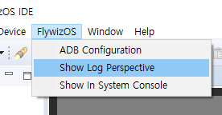

# View log
## Add log
* Required header file
  ```c++
  #include "utils/Log.h"
  ```
  FlywizOS print uniformly calls `LOGD` or `LOGE` macro output, and the usage method is the same as that of C language `printf`; there are examples of calling in the code generated by default (commented out by default, open when needed) :

    ```c++
    static bool onButtonClick_Button1(ZKButton *pButton) {
        LOGD("onButtonClick_Button1\n");
        return true;
    }
    ```

## View print

 After connecting [ADB](adb_debug.md), you can view the print log of the program through our tool. The specific steps are as follows :

  1. On the menu bar, select **FlywizOS** -> **Show Log Perspective**, the tool will switch to another interface.

   

  2. In the lower left corner of the new interface, select **LogCat**, if the connection is normal, in the red box area on the right, you will see the machine's print log.

   

   If you want to return to the code editing interface, click the **FlywizOS** icon in the upper right corner of the tool.
     