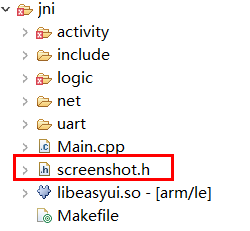

# Screenshot
After the product is developed, when writing the manual, you may need a screenshot of the running interface. You can refer to the following code screenshot.  
## Ready
1. Download the [screenshot.h](https://www.flywizos.com/src/screenshot.h) source file and save it to the project `jni` directory.  
    

## Use

* Required header file
  ```c++
  #include "screenshot.h"
  ```
* Call the interface to take a screenshot  
  ```c++
  static bool onButtonClick_Button1(ZKButton *pButton) {
    //Capture the current screen, save it as a bmp picture, and save it to the TF card directory
    //Each time this function is called, the name of the saved picture is incremented
    //Example - screenshot01.bmp、screenshot02.bmp、screenshot03.bmp
    Screenshot::AutoSave();
    return false;
  }
  ```
  The default picture is saved to the TF card, so try to plug in the TF card and take a screenshot.  
  If you need to save it to another location, you can modify the source code yourself.   
