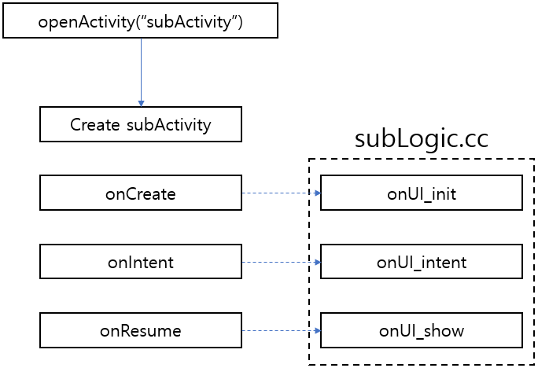
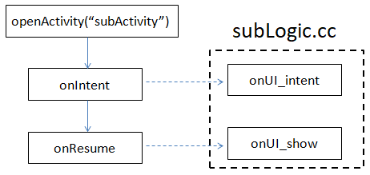

# アクティビティの活動周期
アクティビティ活動周期を紹介する前に、アクティビティ間の階層関係について説明します。


 FlywizOSのアプリケーションは、一番最初に**mainActivity**という開始アクティビティが実行され、`openActivity`関数を使用して **subActivity**、**thirdActivity**を実行することができます。 上の図は、アクティビティ間の関係を示しており、図のようにアクティビティが保存されているスタックがあり、スタックに**mainActivity**から後で実行されたアクティビティは、既存のアクティビティの上にたまるの形で構成されます。


## アクティビティの実行過程
`openActivity`関数を呼び出した後の過程を見てみましょう。どちらの場合があります。

1. アクティビティスタックに実行するアクティビティがない場合

   

    **subLogic.cc**の`onUI_init`関数を見てみましょう。アクティビティスタックにアクティビティがない場合に、この関数が使用されます。この関数が呼び出されたのは、すべてのコントロールのポインタも初期化が完了したことを意味します。この関数では遅く、次のようにいくつかのタスクを実行することができます。

   ```c++
   static void onUI_init() {
      //Tips :Add the display code of UI initialization here, such as:mTextView1Ptr->setText("123");
      LOGD("sub onUI_init\n");
      mTextView1Ptr->setText("123");
   }
   ```

   もし初期化時に、ユーザーが特定のデータを渡すしたい場合は`onUI_intent`関数でそのデータを渡すことができます。

   ```c++
   static void onUI_intent(const Intent *intentPtr) {
      LOGD("sub onUI_intent\n");
      // Judge not empty
      if (intentPtr) {
         // Key value analysis
         std::string cmd = intentPtr->getExtra("cmd");		// "open"
         std::string value = intentPtr->getExtra("value");	// "ok"
         ......
      }
   }
   ```
    `onUI_show`関数 - アクティビティの表示完了コールバック関数

2. アクティビティスタックに実行するアクティビティが存在する場合

   

   この場合、該当するアクティビティがアクティビティスタックの最上位に移動され、~~`onUI_init`~~関数は呼び出されません。

   

   実行されるアクティビティが表示される場合直前の最上位のアクティビティは隠されます。

   以下は**mainActivity**で**subActivity**が実行されるときのプロセスを示しています。

   

   この過程で重要な場違いな部分は**mainActivity** **hide**------>**subActivity** **display**です。


## アクティビティ終了過程
アクティビティを終了するには、3つの方法があります。

1. `goBack()` - 最上位アクティビティをすぐに終了します。

   

   アクティビティが終了すると、`onUI_quit`関数が呼び出され、もし解除が必要なリソースがある場合は、この関数から解放することを推奨します。

   

   最上位アクティビティが終了した後、次のアクティビティの`onUI_show`関数が呼び出され、アクティビティが表示されます。

   

2. `goHome()` - すぐに**mainActivity**に移動され、**mainActivity**以外のすべてのアクティビティが終了します。

   

   

3. `closeActivity("xxx")` - 特定のアクティビティを終了します。（**mainActivity**を除く）は、アクティビティが最上位アクティビティがなければ、サブアクティビティの`onUI_show`は呼び出されません。