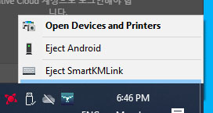
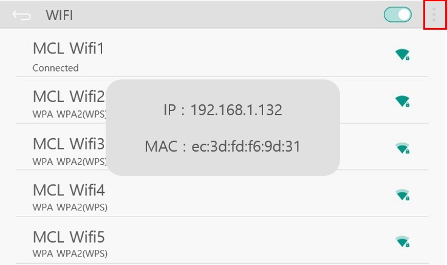

# ADBダウンロードとデバッグ
FlywizOSはUSBまたはWIFIを介してプログラムを迅速にダウンロードすることができ、具体的な手順は次のとおりです。

## まず、コンピュータとボードを接続するために、ここには二つの方法があります。
> [!Note]
>
> ##### Note：もしWIFI付きボードを購入した場合は、WIFIを介してのみ接続が可能です。(USB接続不可)
>
> ##### WIFIがないバージョンを購入したら、USBを利用して、コンピュータを接続すると、以下のように接続状態を確認できますだ。
>
> 

 1. コンピュータとボードをUSBケーブルを使用して接続 -  USBケーブルを使用して、コンピュータとデバイスを接続します。コンピュータがデバイスをAndroidデバイスとして認識することができれば、接続は正常です。 正常に接続できない場合は、コンピュータにドライバの問題が表示されます。[ドライバのダウンロードとインストール](install_adb_driver.md)をお試しください。

 2. WIFI経由で接続(この方法は、ボードがWIFIをサポートする必要があります。) 
    まず、ボードのWIFI設定を使用してボードをコンピュータと同じネットワークに接続します。ネットワーク設定後のボードのIPアドレスを確認し、そのIPアドレスをFlywizOS IDEの設定と、IDEは、ボードとの接続を試みて成功時に成功確認のポップアップが表示されます。（もし失敗した場合のボードのIPアドレスが正しいことを確認してください。）

    WIFI設定アクティビティ  
       
    
    IDEのIPアドレスの設定   
      

## ダウンロードとデバッグ
上の過程が完了すると、ユーザーは、ボードにプログラムを直接ダウンロードすることができます。プロジェクトエクスプローラで、ダウンロードするプロジェクトの名前を選択し、右クリックして、ポップアップメニューから**Download and Debug**を見つけてクリックすると、自動的にプログラムがコンパイルされ、コンパイルが成功すると、ボードにプログラムがダウンロードされます。以後、通常のダウンロードに成功すると、ボードからダウンロードしたプログラムが実行されることを見ることができます。

同様に、プロジェクトを選択し、**Ctrl + Alt+ R**キーを押すとダウンロードが可能です。

[**ログを利用したデバッグ**](logcat.md)

# 注意事項
* もしコンピュータに他のAndroidデバイスが接続されている場合は、その機器の接続を解除する必要があります。だ。そうでない場合は、ダウンロードの失敗の原因になることがあります。
    * ** Note：この方法でプログラムを実行する場合、プログラムは、ボードに保存されていないので、電源をオフにする場合は、次の電源接続時に既存のボードに内蔵されているプログラムで実行されます。（もしプログラムをボードに保存したい場合は、["更新イメージの作成」](make_image.md)参照してください）**