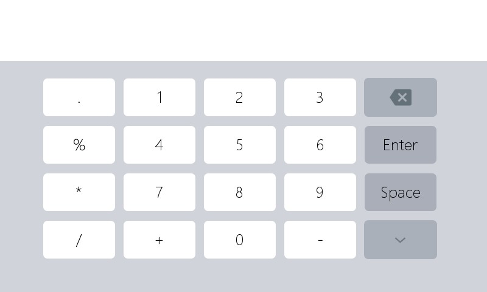

# Edit Text
## もし数字キーボードが必要か、ユーザーがテキストを入力できるようにするには、どうでしょうか
## <span id = "add_edit_text">Edit Text box追加する</span>
 もし数字やテキストの入力が必要な場合は、`Edit Text`コントロールを利用して迅速に実装することができます。その過程は、以下のとおりです。
1. プロジェクトウィンドウでボタンを追加しようとするアクティビティのUIをダブルクリックします。

2. 右側のコントロールボックスで`Edit Text`コントロールを選択します。

3. `Edit Text`コントロールをマウスの左クリックした後、目的の場所をクリックするか、ドラッグアンドドロップすると、コントロールが作成されます。

4. 作成されたボタンを左クリックすると、プロパティウィンドウで、ボタンに関連するプロパティを確認し、変更することができます。

5. プログラムをボードにダウンロードして実行した後`Edit Text`コントロールをタッチすると、内蔵された仮想の数字キーボードまたは仮想テキストキーボードが自動的にポップアップされ、これにより、数字やテキストを入力することができます。
             

    内蔵された仮想テキスト入力キーボード   
        

    内蔵された仮想数値入力キーボード
    

基本`Edit Text`は白であり、プロパティウィンドウを使用して、ユーザーが好みのスタイルに変更が可能です。`Edit Text`に関連する属性は次のとおりです。
  * **Password**  
    もし「Yes」を選択すると、キーボード入力時に表示されるテキストが`Password Char`で表示され、「No」の場合、入力したテキストが表示されます。
    
  * **Password Char**  
    `Password`が「Yes」である場合は、キーボード入力時に表示されるテキストを設定します。基本的には「*」が表示されます。
    
  * **Input Type**   
    入力形式は、2つの方法があります。 
     * Text - 英語または数字を入力することができます。    
     * Number - 数字のみを入力できます。
    
  * **Hint Text**  
    何の入力がない場合は自動的に表示されるテキストを設定します。
    
  * **Hint Text Color**  
    **Hint Text**の色を設定します。
    
    

## 仮想キーボードから入力されたコンテンツのインポート
`Edit Text`コントロールを正常に完了した後、コンパイルすると、それに関連する関数が自動的に生成されます。プロジェクトディレクトリで`jni/ logic/**** Logic.cc`ファイルを開くと、その関数を見つけることができます。

```C++
static void onEditTextChanged_XXXX(const std::string &text) {
	  //LOGD("The current input is %s \n", text.c_str());
}
```
仮想キーボードでテキストを入力すると、システムは自動的にその関数を呼び出して、 `text`パラメータを使用して、現在入力されたコンテンツが配信されます。
`std:: string`は、C ++のstringであり、ユーザーは次の例のようにstringポインターを取得することができます。

```C++
const char* str = text.c_str();
```


## 入力されたコンテンツを数値に変換
`Edit Text`に関連する関数では、文字のみの獲得が可能です。だから数字を入力しても、文字取得されるので、これを数字で変える必要があります。

* `atoi`関数は、文字を数字に置き換えることができます。たとえば、文字「213」は、整数`213`に変更することができます。
  もし数字に変更することができない文字が入力されると、変換が失敗することがあります。
  
  예 :  
  `atoi("213abc");` return `213`  
  `atoi("abc");`  return `0`
  ```C++
  static void onEditTextChanged_EditText1(const std::string &text) {
    int number = atoi(text.c_str());
    LOGD("String to number = %d", number);
  }
  ```
* `atof`は文字を浮動小数点数の切り替え関数です。たとえば、「3.14」は、浮動小数点数`3.14`に切り替わります。
  もし浮動小数点数に変更することができない文字が入力されると、変換が失敗することがあります。
  
  例 :  
  `atoi("3.14abc");` return `3.14`  
  `atoi("abc");`  return `0`
  ```C++
  static void onEditTextChanged_EditText1(const std::string &text) {
    // The atof function can convert a string to a corresponding floating point number, for example, "3.14" can be converted to an   // integer 3.14
    // If the parameters are not standardized, the conversion will fail, and the number 0 will be returned uniformly
    double f = atof(text.c_str());
    LOGD("Convert string to floating point = %f", f);
  }
  ```

## カスタムのIME
 デフォルトの入力方法に加えて、ユーザーが希望する形態の入力機を作ることができます。[**Sample Code Package**](demo_download.md＃demo_download)の**ImeDemo**プロジェクトで、その例を見つけることができます。(現在は文字と数字のみです。)

通常のIMEとカスタムのIMEの違いは以下の通りです。
1. 通常のIMEは、`Activity`を継承し実装されるが、カスタムのIMEは` IMEBaseApp`の継承が必要です。
2. さらに登録方法に違いがあります。通常のIMEは、`REGISTER_ACTIVITY（**** Activity）;`を使用して登録されますが、カスタムのIMEは`REGISTER_SYSAPP(APP_TYPE_SYS_IME、**** Activity);`を使用して登録されます。(*\***は、UIファイル名)

 **ImeDemo**プロジェクトを修正して、ユーザー独自のカスタムのIMEを作成することができます。
1. まず、`UserIme.ftu`ファイルをプロジェクトのuiディレクトリにコピーします。
2. `UserImeActivity.h`と`UserImeActivity.cpp`をユーザーのプロジェクトのactivityディレクトリにコピーします。
3. `UserImeLogic.cc`ファイルをプロジェクトのlogicディレクトリにコピーします。

以後`UserImeLogic.cc`ファイルをユーザーにニーズに合わせて変更します。