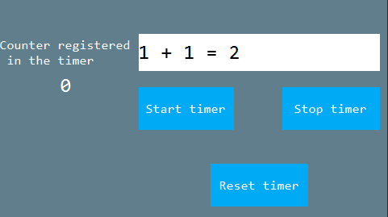

# 任意のタイマー開始と停止
 タイマーを追加する方法で`REGISTER_ACTIVITY_TIMER_TAB`を利用する方法があるが、この方法は、タイマーを任意に開始/停止するのに十分ではない、ここでタイマーを追加する別の方法を説明します。
 There are three functions that control the timer provided in the Activity class, and the following is an example of using each function.

```c++
/**
 * Register timer
 */
void registerUserTimer(int id, int time);
/**
 * Un-register timer
 */
void unregisterUserTimer(int id);
/**
 * Reset timer
 */
void resetUserTimer(int id, int time);
```

1. logic.ccファイルにタイマーが設定されていることを確認するための変数を宣言します。

    ```c++
     /**
      * Whether the timer is registered
      */
     static bool isRegistered = false;
     #define TIMER_HANDLE   2

    ```
2. そして、2つのボタンを作成します。このボタンは、タイマーを起動して停止する機能を実行します。

    ```c++

    static bool onButtonClick_ButtonTimerOn(ZKButton *pButton) {
        //Register the timer if not registered
        if (!isRegistered) {
            mActivityPtr->registerUserTimer(TIMER_HANDLE, 500);
            isRegistered = true;
        }
        return false;
    }

    static bool onButtonClick_ButtonTimerOff(ZKButton *pButton) {
        //If the timer is already registered, cancel the registration
        if (isRegistered) {
            mActivityPtr->unregisterUserTimer(TIMER_HANDLE);
            isRegistered = false;
        }
        return false;
    }

    ```

> [!Warning]
> Do not call the above three functions from the `registerUserTimer`,` unregisterUserTimer`, and `resetUserTimer` from the` onUI_Timer` function. It may cause a deadlock.

## <span id = "example_download">예제 코드</span>
[サンプルコード](demo_download.md#demo_download)TimerDemoプロジェクトを参照してください。
以下はTimer Demoのプレビューです。


     