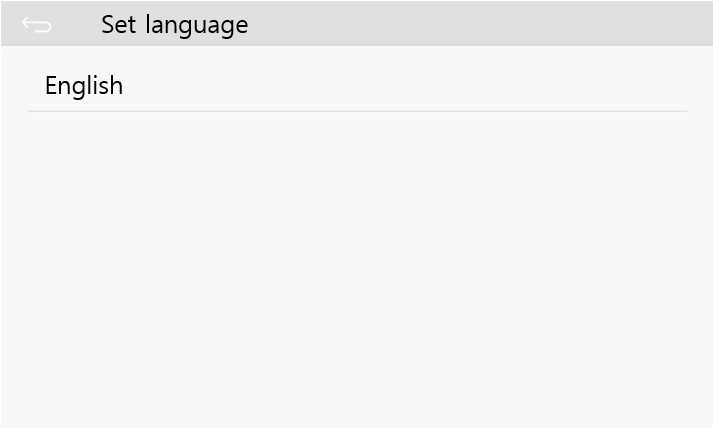
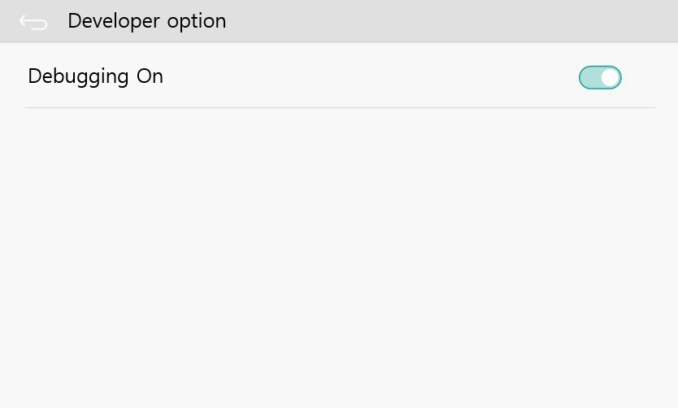

 開発者が直接作成されたアクティビティに加えて、システムで提供されているいくつかの組み込みアクティビティがあります。たとえばTFカードを利用してシステムを更新時に自動的に実行されている内蔵アクティビティがあります。


 加えて、設定アクティビティがあり、以下の方法で実行します。
```c++
EASYUICONTEXT->openActivity("ZKSettingActivity");
```
 私たちは、ボタンなどを利用して設定アクティビティを実行することができます。（他のいくつかの内蔵アクティビティもこの方法で実行が可能です。）:
```c++
static bool onButtonClick_Button1(ZKButton *pButton) {
    EASYUICONTEXT->openActivity("ZKSettingActivity");
    return false;
}
```


 それぞれのアイテムが選択されると、それぞれ内蔵された他のアクティビティが実行されます。まず、** Network**を選択します。
```c++
EASYUICONTEXT->openActivity("NetSettingActivity");
```


 **WIFI** 設定:
```c++
EASYUICONTEXT->openActivity("WifiSettingActivity");
```


 If your board supports WIFI, the WIFI will be displayed in the activity when you activate the WIFI on button on the upper right.

 **Hotspot** 設定:
```c++
EASYUICONTEXT->openActivity("SoftApSettingActivity");
```


**Language** 設定:

```c++
EASYUICONTEXT->openActivity("LanguageSettingActivity");
```


**Touch calibration** 設定:
```c++
EASYUICONTEXT->openActivity("TouchCalibrationActivity");
```


**Developer options** 設定:
```c++
EASYUICONTEXT->openActivity("DeveloperSettingActivity");
```


現在は、唯一のADBデバッグの設定が可能です。
