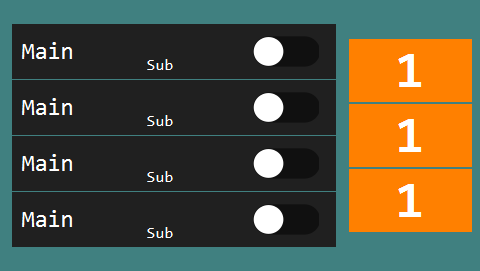

# List control
## 機能
 リストコントロールは、ページ上のすべての情報を表示することができない場合、どの情報が一定の属性に分類される必要があるときに頻繁に使用されます。

## 例
WiFiリスト、deviceリスト、table情報など

## 使い方
1. UIファイルを開き、**List View**コントロールを作成します。そして、2つの**List Subitem**コントロールを追加します。以下は動画の例です。
    

2. 作成されたリストを選択すると、以下のように属性を確認することができます。
       

    それぞれの属性を変更してみボードにダウンロードして、どのように変化するか確認することができます。  
3. 今Outlineを見てみましょう。  
    

    まず、** List1**でリストの行と列を示す** Item**ノードが、基本的に含まれ、追加した** ListSub**ノード2つ含まれていることを確認することができます。    
    ここで、各アイテムのノードをクリックすると、プロパティウィンドウで、関連する属性とその属性に影響を与える範囲をエディタ領域のプレビューで確認することができます。  
    **Note : 各List Viewコントロールは、最大32個のList itemを持つことができます。**

    **Item**と**List Subitem**コントロールは**Button**コントロールと同様の性質を持っています。
    開発者は、好みのスタイルに合わせて、そのプロパティを変更することができます。以下は例を用いて修正した結果です: 

      
4. UIファイルのリストの全体的な属性を調整して表示されるかを確認した後、コンパイルしてください[(FlywizOS プロジェクトのコンパイル)](how_to_compile_flywizOS.md#how_to_compile_flywizOS). その後、自動的に生成された相関関数に必要な機能を追加します。
5. コンパイルが終了するとしているLogic.ccファイルに各リストコントロールに関連付けられ、3つの関数が生成されます。
     *  `int getListItemCount_ListView1()`： 描かれるリストコントロールのアイテム数  
        例：100個のアイテムを表示する場合は、100が返されます。
     *  `void obtainListItemData_List1`： リストの各アイテムに表示されるコンテンツを設定  
        例 : For specific examples, see follow-up documents   
        上記二つの関数はリストのコンテンツを共同で制御します。
     *  `onListItemClick_List1`： リストコントロールのクリックイベント関数  
       リスト上のアイテムをクリックすると、システムは、この関数を呼び出します。そしてパラメータを使用して、現在クリックされたリストアイテムのインデックスを渡します。

## List drawingプロセス
  1. リストを描画したいときは、システムは、まずリストに合計いくつかのアイテムがあることを知る必要があり、そのために提供された`int getListItemCount_ListView1()`関数を使用して総アイテム数を取得します。この関数は、動的に取得されます。したがって、プログラムが動作するのは、必要により、他の値を返すことで、リストのアイテム数を動的に調整することができます。  

  2. その後、システムは`int getListItemCount_ListView1()`で返された数だけ`void obtainListItemData_ListView1(ZKListView *pListView,ZKListView::ZKListItem *pListItem, int index)`関数を呼び出し、呼び出し時のパラメータとして渡されるポインタを利用して、各アイテムのコンテンツを設定することができます。

      
* **Example 1. リストアイテムに表示するコンテンツを設定**
  ~~~C++
  static void obtainListItemData_ListView1(ZKListView *pListView,ZKListView::ZKListItem *pListItem, int index) {
      //The pListItem pointer represents a list item, which can only be used in this function
      char buf[32] = {0};
      //The parameter index indicates which item of the list is currently drawn, starting from 0.
      //Here, we format the index value into a string
      snprintf(buf, sizeof(buf), "Item %d", index);
      //Display the string as text in the list item area
      pListItem->setText(buf);
      //If you have configured the list item "Picture when selected" in the ui file,
      //Then, by setting the selected state of the list item through the following line of code, you can control the list item to
      //display the corresponding state picture
      pListItem->setSelected(true);
  }
  ~~~
* **Example 2. リストサブアイテムに表示するコンテンツを設定**  
もしリストサブアイテムを使用する場合は、以下の方法のようにリストアイテムコントロールポインタからサブアイテムのコントロールポインタを取得して調整することができます。
  ~~~C++
  static void obtainListItemData_ListView1(ZKListView *pListView,ZKListView::ZKListItem *pListItem, int index) {
      char buf[32] = {0};
      //The parameter index indicates which item of the list is currently drawn, starting from 0.
      //Here, we format the index value into a string
      snprintf(buf, sizeof(buf), "The first child of item %d", index);
      //We can get the pointer of the list item through the findSubItemByID() function and the ID of the list item
      //Same as the pListItem pointer, the list item pointer that is found can only be used in this function
      ZKListView::ZKListSubItem* subitem1 = pListItem->findSubItemByID(ID_MAIN_SubItem1);
      if (subitem1 != NULL) {
          //Set the text of list item 1
          subitem1->setText(buf);
      }

      snprintf(buf, sizeof(buf), "The second child of item %d", index);
      ZKListView::ZKListSubItem* subitem2 = pListItem->findSubItemByID(ID_MAIN_SubItem2);
      if (subitem2 != NULL) {
          //Set the text of list item 2
          subitem2->setText(buf);
      }
  }
  ~~~


## リストの修正

 FlywizOSシステムでリストは、一連の規則的なデータのマッピングです。もしデータを追加したり、特定のアイテムを修正するようにリストを修正する場合は、まずデータを修正して、リストを更新します。 その後、システムは自動的に`obtainListItemData_ListView1`関数を呼び出し、この関数で、最終的に修正されたデータに基づいてリストを表示します。  
 これらのプロセスは、次の例に反映されています。

## サンプルコード
[サンプルコード](demo_download.md#demo_download)のListViewDemoプロジェクトを参照してください。

### 例の説明
1. List View ントロールを作成
異なる属性を持つ2つのList Viewコントロールを作成します。
**Cycle List control :** Cycle属性をonします。

    

2. プロジェクトのコンパイル
この手順は、**Logic.cc**ファイルに自動的にList Viewコントロールに関連する関数を作成します。  
["FlywizOS プロジェクトのコンパイル"](how_to_compile_flywizOS.md#how_to_compile_flythings)を参照してください。

3. List1 リスト作成に必要なデータ構造体の設定  
    リストの各アイテムのためのモデルとして構造体を定義します。
    ```c++
    typedef struct {
        //The text displayed in the list item
      const char* mainText;
        //The text to be displayed in list sub item 1
      const char* subText;
        //Turn on/off logo
      bool bOn;
    } S_TEST_DATA;
    ```
    仮想のリストデータのための構造体の配列を定義します。
    ```c++
    static S_TEST_DATA sDataTestTab[] = {
      { "Test1", "testsub1", false },
      { "Test2", "testsub2", false },
      { "Test3", "testsub3", false },
      { "Test4", "testsub4", true },
      { "Test5", "testsub5", false },
      { "Test6", "testsub6", true },
      { "Test7", "testsub7", false },
      { "Test8", "testsub8", false },
      { "Test9", "testsub9", false },
      { "Test10", "testsub10", false },
      { "Test11", "testsub11", false }
    };
    ```

4. 自動的に生成されたリスト関連の関数にコードを追加します。
    ```c++
    static int getListItemCount_List1(const ZKListView *pListView) {
        //Use the length of the array as the length of the list
        return sizeof(sDataTestTab) / sizeof(S_TEST_DATA);
    }

    static void obtainListItemData_List1(ZKListView *pListView,ZKListView::ZKListItem *pListItem, int index) {
        //Get the pointer of the list sub item 1 and name it psubText
        ZKListView::ZKListSubItem* psubText = pListItem->findSubItemByID(ID_MAIN_ListSub1);
        //Get the pointer of the list sub item 2 and name it psubButton
        ZKListView::ZKListSubItem* psubButton = pListItem->findSubItemByID(ID_MAIN_ListSub2);
        pListItem->setText(sDataTestTab[index].mainText);
        //Take index as the subscript, get the corresponding structure from the array, get the text that needs to be displayed 
        //from the structure, and finally set it to the corresponding list item
        psubText->setText(sDataTestTab[index].subText);
        //In the UI file, we set the selected image property for the list sub item 2
        //Here, according to the `bOn` value of the structure, the selected state of the list item is set, so that if the member
        //`bOn` is true, it is set to be selected, and the system will automatically display the selected picture previously set
        psubButton->setSelected(sDataTestTab[index].bOn);
    }

    static void onListItemClick_List1(ZKListView *pListView, int index, int id) {
        //When you click the index item in the list, modify the bOn variable to reverse bOn. In this way, every time you click on
        //the list, the picture will switch once
        //Note that the operation of picture switching is completed in the obtainListItemData_List1 function, and now we only 
        //modify the value of this variable.
        sDataTestTab[index].bOn = !sDataTestTab[index].bOn;
        //The last sentence of code modified the structure data, and now we want to refresh the list immediately, and call
        //refreshListView to force a refresh
        //After the refresh is triggered, the system will call the two functions getListItemCount_List1 and 
        //obtainListItemData_List1 again, so that the modified data corresponds to the list display.
        mList1Ptr->refreshListView();
    }
    ```
5. コードの追加が完了したら、ダウンロードして実行した後、結果を確認します。
