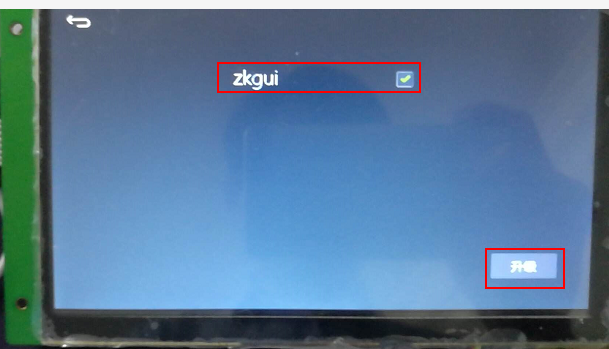

# Upgrade imageファイルの作成
 先進の章では、我々は、[ダウンロードおよびデバッグ](adb_debug.md＃下载调试)メニューを使用してプログラムを実行しました。しかし、それはプログラムをボードに保存することがないので、TFカードを削除したり、ボードの電源をオフにした再起動時にダウンロード前のプログラムで実行されます。 したがって、もしボードにプログラムを保存したい場合は、まずプログラムを更新イメージファイルとして作成ボードを更新します。その後、更新後の再起動時に更新されたプログラムが実行されます。

## 使い方
まず、更新イメージファイルが作成されるパスを設定します。   
1. ツールバーの下の画像を検索します。   
   

2. ドロップダウン矢印ボタンをクリックして、ポップアップメニューの**Path Setup**を選択します。   
   

3. ポップアップボックスで、更新イメージファイルを保存するパスを選択し、OKをクリックします。
4. 上記の過程で、私たちは、更新イメージファイルのパスを設定しました。今下の図のボタンを押します。その後、IDEは、コンパイルを実行し、その結果をパッケージ化して**update.img**ファイルを設定されたパスに作成します。      
   

5. **update.img**"ファイルが正常に作成された後、TFカード（注意：FAT32形式のTFカードのみをサポート）のrootディレクトリにコピーして、ボードに挿入します。 その後、システムは、TFカードのファイルを検出し、下の図のようにアップデートプログラムを実行します。 その後のチェックボックスをタッチしてチェックした後に更新ボタンを押すと、アップデートが開始されます。アップデートが完了した後は、すぐにカードを削除して再更新されることを防止します。    
      

**もしボードのタッチが壊れているか、タッチがないボードの場合、ボタンをクリックすることができないアップデートができません。この場合は、[自動更新](autoupgrade.md)を参照して更新します。**