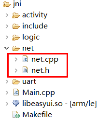

# Socket programming
もしLinux socket programmingに精通している開発者であれば、standard Linux socket programming interfaceに応じて、ネットワークプログラミングをすることができます。
例を持ち上げるためにFlythings OSはTCPクライアントを構築するために一般的に使用されるソケットプログラミングの実装に便利なLinuxの標準インターフェースに基づいて、単純なパッケージを作成しました。必要に応じて手順に従ってソースコードをプロジェクトに統合することができます。

## Porting steps  
1. プロジェクトのjniフォルダの下に新しいフォルダを作成し、名前を`net`にします。   
       

2. [net.h](https://developer.flywizos.com/src/net/net.h), [net.cpp](https://developer.flywizos.com/src/net/net.cpp) 両方のファイルをダウンロードして`net`フォルダに保存します。   
      

## 使い方
### TCP Client
* 必要なヘッダファイル
  ```c++
  #include "net/net.h"
  ```
* 例
  ```c++
  //Use TCP protocol to connect to port 80 of the domain name www.baidu.com, and change the domain name to IP.
  net::Conn* conn = net::Dial("tcp", "www.baidu.com:80");
  //net::Conn* conn = net::Dial("tcp", "14.215.177.38:80");
  if (conn) {
    byte buf[2048] = {0};
    const char* req = "GET / HTTP/1.1\r\nConnection: close\r\n\r\n";
    //send
    conn->Write((byte*)req, strlen(req));
    while (true) {
      //read，1000ms timeout
      int n = conn->Read(buf, sizeof(buf) - 1, 1000);
      if (n > 0) {
        buf[n] = 0;
        LOGD("read %d bytes： %s", n, buf);
      } else if (n == 0) {
        LOGD("Normal disconnection");
        break;
      } else if (n == net::E_TIMEOUT) {
        LOGD("read timeout");
      } else {
        LOGD("error");
        break;
      }
    }
    //Close the connection
    conn->Close();
    //Release memory
    delete conn;
    conn = NULL;
  ```

### UDP Client
* 必要なヘッダファイル
  ```c++
  #include "net/net.h"
  ```
* 例
  ```c++
  //Use udp protocol to connect IP: 192.168.1.100 port 8080
  net::Conn* conn = net::Dial("udp", "192.168.1.100:8080");
  if (conn) {
    byte buf[2048] = {0};
    const char* req = "hello";
    conn->Write((byte*)req, strlen(req));
    while (true) {
      //read，1000ms timeout
      int n = conn->Read(buf, sizeof(buf) - 1, 1000);
      if (n > 0) {
        buf[n] = 0;
        LOGD("read %d bytes： %s", n, buf);
      } else if (n == 0) {
        LOGD("Normal disconnection");
        break;
      } else if (n == net::E_TIMEOUT) {
        LOGD("read timeout");
        //Set timeout here to exit
        break;
      } else {
        LOGD("error");
        break;
      }
    }
    //Close the connection
    conn->Close();
    //Release memory
    delete conn;
    conn = NULL;
  }
  ```

