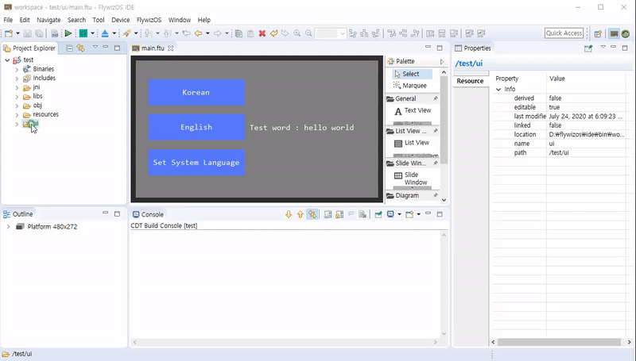
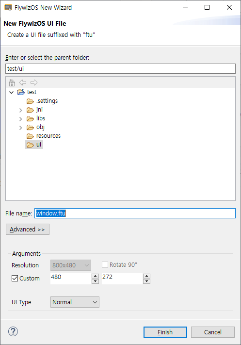

# 新しいFlywizOS UIファイルの作成  
新しいUIファイルを生成することは、[新しいFlywizOSプロジェクトの作成](new_flythings_project.md＃new_flythings_project)と似ています。
1. Project ExplorerでUIファイルを生成しようとするプロジェクトの**ui**フォルダを右クリックし、ポップアップされるメニューから**New** - >**FlywizOS UI file**を選択します。

     
2. 上記の手順を実行すると、**New FlywizOS UI File Wizard**が下に見えるようにポップアップされます。

     

   ここでは、入力する3つのプロパティがあります。
   
  * **File name**   
     UIファイルのファイル名を指定する必要があります。ファイル名は、文字と数字で指定され、拡張子は**ftu**（FlywizOS UIファイル）です。
     
   * **Resolution**  
      解像度をピクセル単位で調整してUIインターフェイスのwidthとheightを制御することができます。
      
   * **UI Type**   
      現在のウィンドウタイプには、**Normal**、**Status Bar**、**Navigation Bar**、**Screensaver**があります。一般的に、**Normal**が選択され、他の3つのタイプには、[システムアプリケーションの概要](system_app.md)を参照してください。

 プロパティの設定が終わった後、**Finish**を選択すると、作成プロセスが終了され、project explorerのプロジェクトuiフォルダから、新しく作成されたファイルを見ることができます。

 

 

 

 

 

 

 

 