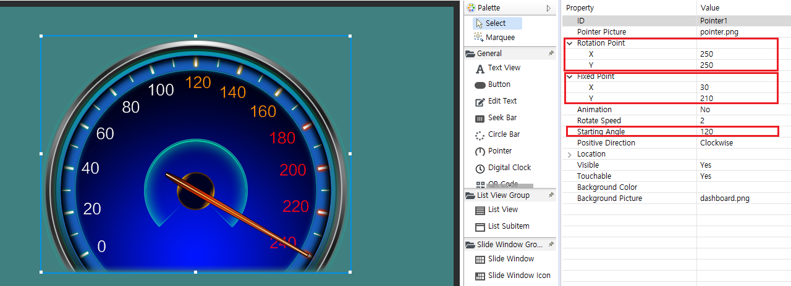

# Pointer control
## 特徴
 メーターや時計の回転と同様の効果を得るために、このコントロールで簡単に実装することができます。このコントロールは、グラフィックス回転を処理するように特別に設計されました。

## アイデア
 メーターを実装するには、静的な背景画像と背景画像の上に回転するポインタ画像の二つの部分に分けることができます。  
 したがって、背景画像とポインタ画像を選択した後、ポインタの回転の中心座標のみ決定します。

## 使い方
1. まず、**Pointer**コントロールを作れば、次の属性を確認することができます。

      
    まだコントロールの作成方法がわからない場合は、[ボタンコントロールの作成方法](button.md＃add_button)を参照してください。
    属性マップで**Pointer Picture**と**Background Picture**を追加したことを見ることができます。
    追加のプロセスは、アニメーションに表示されます。 

    

2. 上記の最後のプレビュー画像で判断すると、問題が検出されておらず、背景画像とポインタの位置が正常に見えます。しかし、プログラムが実際に実行された後は、240°で開始するため、間違っている。迅速かつ簡単な調整のために**Starting Angle**属性は、他の角度（デフォルトは0）に設定することができ、ここで120に調整します。ポインタが120°回転した後で、ポインタの回転の結果が予想と異なっていることがわかります。  
      
    その理由は、ポインタが回転する円形の中心座標が正しくないからです。
    ポインタの回転中心の座標を決定する2つのプロパティは、** Rotation point**と** Fixed point**です。

   * Rotation point   
   座標は、コントロールの全体の矩形領域を参照します。コントロールの矩形領域の左上隅には、[0,0]（ピクセル単位）です。これらのメーターの場合は、必要回転点の座標は、明らかにダイヤルの中央にあります。これで、図の特定の座標は、以下のように（250、250）です。  
     
   * Fixed point  
   座標は、ポインタの図を参照して、図の左上隅には、[0,0]で単位はピクセルです。これらのポインタ図の場合は、必要ポインタの固定点の座標は（30、210）です。  
     

   座標をプロパティ]ウィンドウに入力すると、ポインタが正しい位置に回転することを見ることができます。  

   

    **Starting angle**は負の値をサポートします。上記の例では、**Starting angle**を-120に変更すると、ポインタがダイヤル0の位置を指します。

## ポインタFixed Pointのヒント 
上記の例では、ポインタのFixed Point座標は、ポインタ画像に位置し、実際にこの座標は、カーソルの効果を得るために、図の範囲を超えることがあります。下の図のように赤いボックスの白は、実際にポインタ画像に比較的小さい右属性では、図の実際のサイズをはるかに超えるポインタ固定点の座標を設定し、回転座標を調整して円形のカーソルの効果を取得します。


## 操作関数 
これらのタイプのコントロールのための最も一般的な方法は、コードを介してポインタの回転角度を調整することです。
```c++
//Adjust the pointer to 90 degrees
mPointer1Ptr->setTargetAngle(90.0);
```


# Sample code
[Sample Code](demo_download.md#demo_download)のPointerDemoプロジェクトを参照してください。