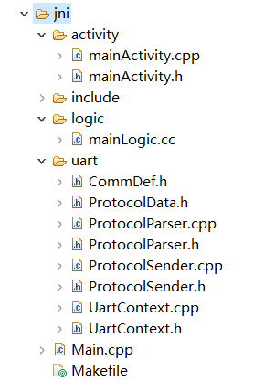

# <span id = "project_structure">FlywizOSプロジェクトのコードの構造の概要</span>
コードの記述を開始する前に、まずFlywizOSプロジェクトの基本的な構造を理解する必要のコードを追加する必要がある位置を知ることができます。  
基本FlywizOSプロジェクトの場合、ディレクトリ構造は次のとおりです。

  

**jni**、**resources**、**ui**の3つのフォルダに分けられます。各フォルダの役割は、以下に説明されています。

* ## ui폴더  
  **ui**フォルダ展開します。 
  
      
  
   **main.ftu**ファイルは、デフォルトで含まれていることを知ることができます。**ftu**は**FlywizOS**プロジェクトUIファイルのサフィックスです。各**ftu**ファイルは、アクティビティに対応します。一般的に、アプリケーションは、複数のアクティビティが含まれていますので、**ui**フォルダに複数**ftu**ファイルを作成します。 新しい**ftu**ファイルを追加するには、[新しいFlyThings UIファイルの作成方法](new_flywizOS_ui_file.md)を参照してください。説明の便宜のために以降**ftu**ファイルを**UIファイル**とします  
   ダブルクリックして、** UIファイル**を開いて編集して効果をすぐに確認することができます。** UI**ファイルの編集の詳細については、**コントロールの概要**を参照してください。
   編集後"**compile**"を開始することができます。([コンパイル方法](how_to_compile_flywizOS.md))
  
  > [!Note]
  > **注：ここに記載されたコンパイルは、ソースコードのコンパイル日だけでなくuiファイルの前処理とテンプレートコードの生成のような一連の作業でもあるが、これらのタスクは、すべて自動化されているので、手動で作業する必要がありません。 コンパイル - この作業のすべての特定のタスクには、[コンパイルプロセスとUIファイルとソースコードとの間の相関関係](ftu_and_source_relationships.md＃ftu_and_source_relationships)を参照してください。これを読んだ後は、理解しやすくすぐに開始できようになります** 

* ## resources folder  
   このフォルダの内容は、比較的簡単で、主に図、フォント、入力方法の設定ファイルなどを含むプロジェクトのさまざまなリソースファイルを保存するために使用されます。他のリソースファイルがある場合は、このフォルダに追加することもできます。フォルダは、システムに完全にコピーされます。ただし、機器自体の保存スペースの制限で、このディレクトリに大容量のファイルを保存していないことが望ましく、大容量のリソースファイルは、TFカードに保存することをお勧めします。  
   コードのresourcesディレクトリにあるファイルの絶対パスを取得することができます。  
   例：次のコードは、resources/test.txtの絶対パスを取得することができます。
   ```c++ 
   #include "manager/ConfigManager.h"
   std::string resPath = CONFIGMANAGER->getResFilePathEx("test.txt");
   ```
* ## jni folder  
   このフォルダは、主にコードファイルを保存するために使用されます。**jni**フォルダを展開します。  

     

   上に見えるように、ここでは、**activity**、**include**、**logic**、**uart**、**Main.cpp**、**Makefile**の6つの部分が含まれています。各部分の機能は次のとおりです。
   
   * **activity subfolder**   
     UIファイルの基本クラスのコードを保存します。各UIファイルがコンパイルされた後、同じプレフィックス名を持つ`Activity`クラスと`Logic.cc`ファイルが生成されます。 
     例：uiフォルダに**main.ftu**がある場合、コンパイル後`mainActivity.h`、` mainActivity.cpp`と`mainLogic.cc`が生成され、` mainActivity`クラスが**activity**フォルダに保存されます。`mainLogic.cc`ファイルは**logic**フォルダに保存されます。     
     > [!Warning]   
     > **特別な状況を除いて、activityフォルダの下のコードは変更しないでください。**
          
   * **logic subfolder**  
     特定の論理コードを保存します。上記の説明と同様に、すべてのUIファイルは、コンパイル後、プレフィックスの名前がある**Logic.cc**ファイルを生成します。**注：カスタムコードは、主にこれらのLogic.ccファイルに追加されます**。

   * **include subfolder**  
     システム関連のヘッダファイルと、すべてのコントロールに関連のヘッダファイルは、主にここに保存されます。

   * **uart subfolder**  
     名前が示すように、このフォルダには、シリアルポートの読み取りと書き込み、プロトコル分析などを含むシリアルポートの動作に関連するコードが格納されます。

   * **Main.cpp**  
     起動および開始アクティビティを選択する関数など、全体FlywizOSアプリケーションの初期化コードが含まれ、一般的にファイルを変更する必要がありません。

   * **Makefile/Android.mk, Application.mk**  
     特定のソースコードのコンパイルプロセスを含むコンパイル構成ファイルに、一般的に変更する必要がありません。 

コンパイル後**libs**ディレクトリと**obj**ディレクトリがプロジェクトの下に作成されます。このディレクトリは、コンパイルされたターゲットストレージディレクトリと、コンパイルされた一時ファイルのディレクトリであり、両方の直接整理したり、削除することができます。

