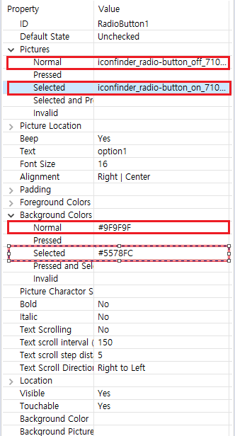
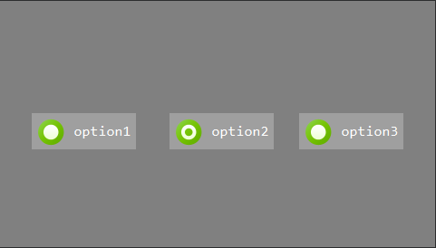

# RadioGroup
 複数のオプションから単一選択の場合`RadioGroup`コントロールを直接使用することができます。
 いずれかのオプションをクリックすると、オプションが自動的に選択された状態になり、同じグループの他のオプションは、選択されていない状態になります。これらのオプションの状態を切り替える時に、図の色もプロパティ]ウィンドウの設定に応じて自動的に切り替わります。

## How to use
1. ダブルクリックしてUIファイルを開きます。
2. 右側のコントロールボックスで`RadioGroup`コントロールを検索します。   
     
    
3. `RadioGroup`コントロールでマウスの左ボタンをクリックした状態で目的の場所にドラッグした後、左のボタンを離すと自動的に矩形領域が生成されるのを見ることができ、その領域は`RadioButton`コントロールを保持することができるコンテナを表します。
4. 同じドラッグアンドドロップ操作を使用して矩形領域に複数の`RadioButton`コントロールを追加することができます。
5. 追加された`RadioButton`コントロールをマウスの左ボタンでクリックすると、右側の関連プロパティを表示することができます。必要に応じて、各コントロールの各状態図の色を設定することができます。ここで選択した場合**Picture and Background Colors**属性に注意してください。

      

   画像を設定した後、画像のサイズが異常に表示されている場合、**Picture Location**属性で画像の位置とサイズを調整することができます。  
   **Default State**属性で**Checked**または**Unchecked**を設定することもできます。

6. プロパティを設定した後、コンパイルすると、関連する関数が該当する`Logic.cc`に生成されます。
   RadioButtonのいずれかをクリックすると、システムで関連する関数を呼び出します。ここで`int checkedID`パラメータは、選択されたRadioButtonの「ID」を表します。
   このIDの値に基づいて、現在クリックされたRadioButtonを確認することができます。
   この「ID」は、マクロ定義の整数値です。UIファイルがコンパイルされた後、各コントロールは、マクロIDを自動的に生成します(マクロの詳細については、[命名規則](name_rule.md＃id_macro_rule)を確認してください)。  
   各オプションのマクロIDは、`Activity.h`ヘッダファイルで見つけることができます。例 :
   
     
   
   その後、次の相関関数でクリック項目を判断することができます。
   ```c++
    static void onCheckedChanged_RadioGroup1(ZKRadioGroup* pRadioGroup, int checkedID) {
      LOGD("Checked ID = %d", checkedID);
      switch (checkedID) {
        case ID_MAIN_RadioButton1:
          LOGD("First RadioButton");
          break;
        case ID_MAIN_RadioButton2:
          LOGD("Second RadioButton");
          break;
        case ID_MAIN_RadioButton3:
          LOGD("Third RadioButton");
          break;
        default:
          break;
      }
    }
   ```

7. ダウンロードおよびデバッグ、効果を確認します。

## サンプルコード  
[Sample Code](demo_download.md#demo_download)のRadioGroupDemoプロジェクトを参照してください。
例のプレビュー :


