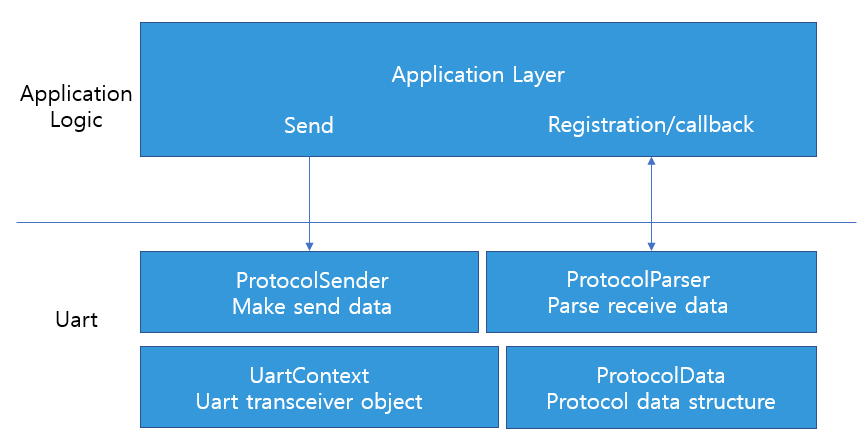
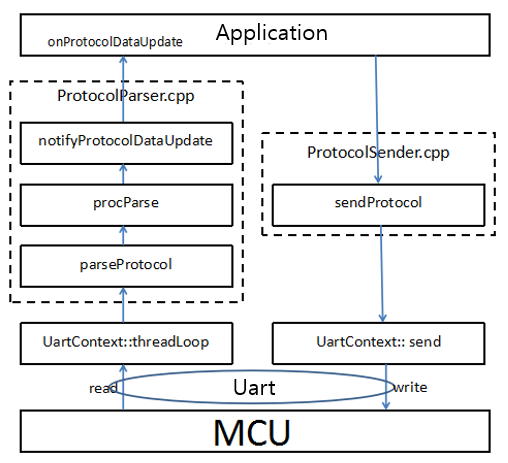
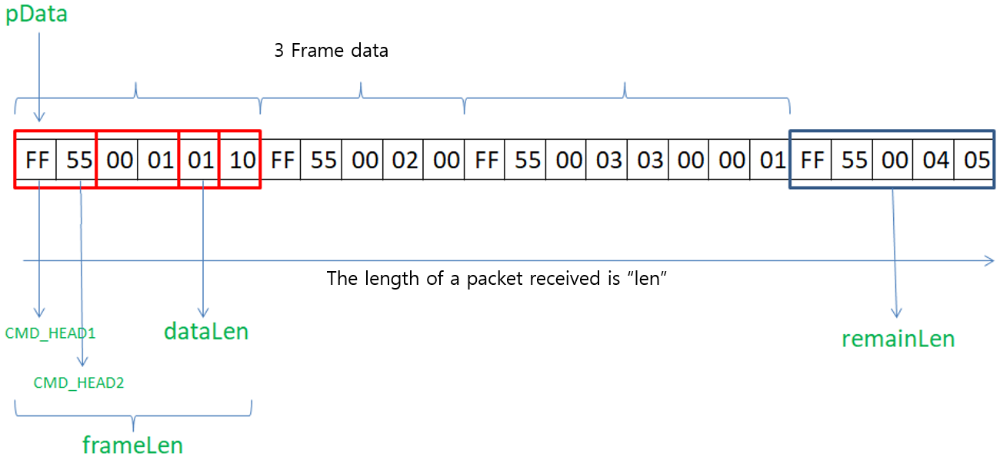

# 通信フレームワークの説明

 この章では、通信フレームワークの実装原理に焦点を当てており、理論的なものは比較的多いです。最初は、通信モデルのおおよその概要について理解し、提供されている[Case](serial_example.md)を直接実行見た後戻って原理を理解しましょう。このような過程を経て、実際の実行をしてみると好きなようにプロトコルを定義して使用することができるでしょう。


## フレーム


ソフトウェアAPP部分は、二つの層に分かれています。
* UART - プロトコル解析とカプセル化のシリアルポートHAL層
	* UartContext：シリアルポートスイッチ、送受信インタフェースを提供するシリアルポートの物理的な制御層
	* ProtocolData：通信プロトコルで変換された実際の変数を格納するために使用される通信データ構造の定義
	* ProtocolSender：データ転送のカプセル化完成
	* ProtocolParser：データのプロトコル解析を完了した、次の構文解析されたデータをProtocolDataのデータ構造体に入れると同時に、アプリケーションがシリアル・データの変更を監視することができるよう、コールバックインターフェースを管理します。
* APP - アプリケーションインターフェイス層
	* ProtocolParserで提供されるインタフェースを介して受信し、監視するシリアルポートのデータを登録して、シリアルポートの更新されたProtocolDataを取得します。
	* ProtocolSenderで提供されるインタフェースを介してMCUにコマンド情報の転送

このプロセスを再 - 定義してみましょう :


**receive**と**send**両方のプロセスが上下に進んで、各レイヤーの機能が比較的明確であることは明らかです。

コードに対応する具体的な手順は次のとおりです。



 受信または送信プロセスに関係なく、シリアルポートの最終的な読み取りおよび書き込み操作は、「UartContext」を介して行われます。これは、標準化されたプロセスであるため、基本的には`UartContext`を変更する必要がなく、実装方法を無視することができます。はい、もちろん関心がございましたら、確認することができます。
 この時点で、私たちは、この通信モデルの一般的な理解を持っているものであり、後に具体的なコードの実装を説明します。

## プロトコル受信部の使用、および編集方法

### 通信プロトコルの形式を変更
ここで、より一般的な通信プロトコルの例を提供しています。

| frame header(2bytes) | command(2bytes) | length of data(1byte) | command data(N) | verification(1byte, option) |
| --- | --- | --- | --- | --- |
| 0xFF55 | Cmd | len | data | checksum |

CommDef.hファイルは、同期フレームのヘッダ情報と最小データパケットサイズ情報を定義します。
```c++
// When you need to print the protocol data, open the following macro
//#define DEBUG_PRO_DATA

// Support checksum verification, open the following macro
//#define PRO_SUPPORT_CHECK_SUM

/* SynchFrame CmdID  DataLen Data CheckSum (Option) */
/*     2Byte  2Byte   1Byte	N Byte  1Byte */
// Minimum length with CheckSum: 2 + 2 + 1 + 1 = 6
// Minimum length without CheckSum: 2 + 2 + 1 = 5

#ifdef PRO_SUPPORT_CHECK_SUM
#define DATA_PACKAGE_MIN_LEN		6
#else
#define DATA_PACKAGE_MIN_LEN		5
#endif

// Sync frame header
#define CMD_HEAD1	0xFF
#define CMD_HEAD2	0x55
```

ProtocolParser.cppファイル、構成ファイルコマンドの形式
```c++
/**
 * Function: Analyze protocol
 * Parameters: pData - protocol data, len - data length
 * Return value: the length of the actual protocol
 */
int parseProtocol(const BYTE *pData, UINT len) {
	UINT remainLen = len;	// Remaining data length
	UINT dataLen;	// Packet length
	UINT frameLen;	// Frame length

	/**
	 * The following parts need to be modified according to the protocol format to parse out the data of each frame
	 */
	while (remainLen >= DATA_PACKAGE_MIN_LEN) {
		// Find the data header of a frame
		while ((remainLen >= 2) && ((pData[0] != CMD_HEAD1) || (pData[1] != CMD_HEAD2))) {
			pData++;
			remainLen--;
			continue;
		}

		if (remainLen < DATA_PACKAGE_MIN_LEN) {
			break;
		}

		dataLen = pData[4];
		frameLen = dataLen + DATA_PACKAGE_MIN_LEN;
		if (frameLen > remainLen) {
			// Incomplete data frame
			break;
		}

		// To print a frame of data, open the DEBUG_PRO_DATA macro in the CommDef.h file when needed
#ifdef DEBUG_PRO_DATA
		for (int i = 0; i < frameLen; ++i) {
			LOGD("%x ", pData[i]);
		}
		LOGD("\n");
#endif

		// Support checksum verification, open PRO_SUPPORT_CHECK_SUM macro in CommDef.h file when needed
#ifdef PRO_SUPPORT_CHECK_SUM
		if (getCheckSum(pData, frameLen - 1) == pData[frameLen - 1]) {
			// Parse a frame of data
			procParse(pData, frameLen);
		} else {
			LOGE("CheckSum error!!!!!!\n");
		}
#else
		// Parse a frame of data
		procParse(pData, frameLen);
#endif

		pData += frameLen;
		remainLen -= frameLen;
	}

	return len - remainLen;
}
```
 上記の分析プロセスは少し複雑です。まず、下の図を見た後分析すると、理解し、より容易になります。データパケットは、0または複数のフレームのデータを含めることができます。下の図では、3つのフレームのデータを表示しました。そして、まだデータが5byte不足不完全なデータフレームがあります。不完全なデータフレームは、次のデータパケットにつながります。



* プロトコルヘッダを変更する必要があります。

```c++
// 1.Modify the definition of the protocol header. If the length of the protocol header changes, pay attention to modifying the
// statement of the protocol header judgment part.
#define CMD_HEAD1	0xFF
#define CMD_HEAD2	0x55

// 2.You need to modify this when the length of the protocol header changes.
while ((mDataBufLen >= 2) && ((pData[0] != CMD_HEAD1) || (pData[1] != CMD_HEAD2)))
```

* プロトコルの長さの位置を変更または長さの計算方法を変更

```c++
// Here pData[4] represents the fifth data is the length byte, if it changes, please modify it here.
dataLen = pData[4];
// The frame length is generally the data length plus the head and tail length. If the length calculation method passed in the 
// agreement changes, modify this part.
frameLen = dataLen + DATA_PACKAGE_MIN_LEN;
```

* 検証が変更される場合

```c++
/**
 * By default, we turn off checksum verification. If you need to support checksum verification, open the PRO_SUPPORT_CHECK_SUM 
 * macro in the CommDef.h file
 * When the verification is different, the verification method needs to be modified.
 * 1.Check the content changes to modify this location
 *     if (getCheckSum(pData, frameLen - 1) == pData[frameLen - 1])
 * 2.Check the calculation formula changes to modify the content in the getCheckSum function
 */

/**
 * Get checksum code
 */
BYTE getCheckSum(const BYTE *pData, int len) {
	int sum = 0;
	for (int i = 0; i < len; ++i) {
		sum += pData[i];
	}

	return (BYTE) (~sum + 1);
}
```

* データフレームの受信が完了すると、プログラムはprocParseを呼び出して分析します。

```c++
	// Support checksum verification, open PRO_SUPPORT_CHECK_SUM macro in CommDef.h file when needed
#ifdef PRO_SUPPORT_CHECK_SUM
	// Get checksum code
	if (getCheckSum(pData, frameLen - 1) == pData[frameLen - 1]) {
		// Parse a frame of data
		procParse(pData, frameLen);
	} else {
		LOGE("CheckSum error!!!!!!\n");
	}
#else
	// Parse a frame of data
	procParse(pData, frameLen);
#endif
```

### 通信プロトコルのデータをUIコントロールと接続する方法
以前のプロトコルのフレームワークを続けてprocParseの解析部分に入ります。  
キーコードは、ここにあります : ProtocolParser.cpp  
ファイルを開いて、void procParse(const BYTE* pData、UINT len)を検索します。

```c++
/*
 * Protocol analysis
 * Input parameters :
 *     pData: Start address of a frame of data
 *     len: Length of frame data
 */
void procParse(const BYTE *pData, UINT len) {
	/*
	 * Parse the Cmd value to obtain the data and assign it to the sProtocolData structure
     */
	switch (MAKEWORD(pData[2], pData[3])) {
	case CMDID_POWER:
		sProtocolData.power = pData[5];
		LOGD("power status:%d",sProtocolData.power);
		break;
	}
	notifyProtocolDataUpdate(sProtocolData);
}

```
 上記の`MAKEWORD(pData[2]、pData[3])`は、プロトコルの例でCmd値を示します。
 データの分析が完了すると、`notifyProtocolDataUpdate`を介してUIの更新を通知します。この部分は、以下のUIの更新のセクションを参照してください。

* データ構造

 上記のプロトコルはsProtocolData構造として解析され、sProtocolDataは、MCU（またはその他のデバイス）のシリアルポートから送信されるデータの値を格納するために使用される静的変数です。このデータ構造は、ProtocolData.hファイルにあります。ここで、プロジェクト全体で使用される通信パラメータを追加することができます。

```c++
typedef struct {
	// You can add protocol data variables here
	BYTE power;
} SProtocolData;

```

* UIアップデート

 IDEはActivity.cppを生成するときにUIアクティビティのregisterProtocolDataUpdateListenerが完了します。これは、データが更新される登録された関数でデータを受信を意味します。

```c++
static void onProtocolDataUpdate(const SProtocolData &data) {
    // Serial data callback interface
	if (mProtocolData.power != data.power) {
		mProtocolData.power = data.power;
	}

	if (mProtocolData.eRunMode != data.eRunMode) {
		mProtocolData.eRunMode = data.eRunMode;
		mbtn_autoPtr->setSelected(mProtocolData.eRunMode == E_RUN_MODE_MANUAL);
		if (mProtocolData.eRunMode != E_RUN_MODE_MANUAL) {
			mbtn_external_windPtr->setText(mProtocolData.externalWindSpeedLevel);
			mbtn_internal_windPtr->setText(mProtocolData.internalWindSpeedLevel);
		}
	}
    ...
}

```
コードには、ページの静的変数であるmProtocolData変数があります。onUI_init（）の中の初期化されます。
例 :

```c++
static SProtocolData mProtocolData;
static void onUI_init() {
	//Tips :Add the display code for UI initialization here, example : mText1->setText("123");
	mProtocolData = getProtocolData(); // Initialize the structure of the serial port data.
	//Start the UI display of the initial page
}

```

## シリアルデータ転送
 ProtocolSender.cppを開きます。
 APP層が、MCU（またはその他のデバイス）にデータを送信する場合はsendProtocolを直接呼び出すことで十分です。特定のプロトコルカプセル化はsendProtocol関数によって行われます。ユーザーは、自分のプロトコルの要件に応じて、この部分のコードを変更することができます。

```c++
/**
 * Need to be spliced according to the protocol format, the following is just a template
 */
bool sendProtocol(const UINT16 cmdID, const BYTE *pData, BYTE len) {
	BYTE dataBuf[256];

	dataBuf[0] = CMD_HEAD1;
	dataBuf[1] = CMD_HEAD2;			// Sync header

	dataBuf[2] = HIBYTE(cmdID);
	dataBuf[3] = LOBYTE(cmdID);		// Command ID

	dataBuf[4] = len;

	UINT frameLen = 5;

	// Data
	for (int i = 0; i < len; ++i) {
		dataBuf[frameLen] = pData[i];
		frameLen++;
	}

#ifdef PRO_SUPPORT_CHECK_SUM
	// checksum
	dataBuf[frameLen] = getCheckSum(dataBuf, frameLen);
	frameLen++;
#endif

	return UARTCONTEXT->send(dataBuf, frameLen);
}
```
 アクティビティのボタンを押すと、動作が可能です。
```c++
BYTE mode[] = { 0x01, 0x02, 0x03, 0x04 };
sendProtocol(0x01, mode, 4);
```