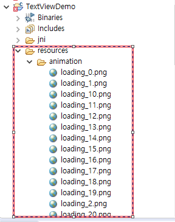
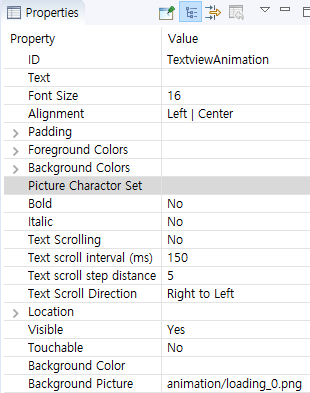
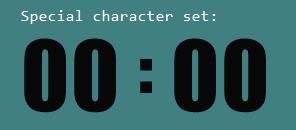
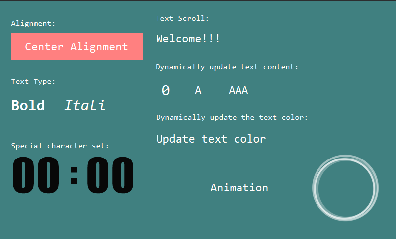

# Text Viewコントロール

## Note

テキストの共通プロパティを変更する方法がわからない場合は、["共通のプロパティ"](ctrl_common.md＃ctrl_common)を参照してください。

## <span id="add_textview">テキスト/ラベルを表示する必要があります。どうすればよい？</span>
テキストを表示する必要がある場合、既存の`Text view`に迅速に実装できます。具体的な手順は次のとおりです。

1. ダブルクリックしてmain.ftuファイルを開きます。
2. 右コントロールボックスで`Text View`コントロールを検索します。
3. `Text View`コントロールでマウスの左ボタンをクリックして、目的の場所にドラッグして、左ボタンを離すと自動的に生成された` Text View`コントロールを見ることができます。

  

## コードを使用して、テキストコンテンツを動的に更新する方法
 シリアルポートLCDを使用する場合Text Viewのコンテンツは、多くの場合、動的に更新されます。次に、コードで`Text View`コントロールに対応するポインタを介してText Viewコントロールの内容を動的に更新することができます。具体的な手順は次のとおりです。

1. まず、コード内のテキストコントロールに対応するポインタ変数を知る必要があります([UIファイルのコントロールIDに対応するコントロールのポインタ変数の命名規則がわからない場合は、こちらをクリックして](named_rule.md))、ここでIDが`Textview1`のText Viewがあります。このコントロールを例に挙げてみると、そのポインター変数は`mTextview1Ptr`です。
2. Textview1コントロールのテキストの内容を`"Hello World"`で変更するには、テキストコントロールのメンバ関数`void setText(const char* text)`を呼び出して実行することができます。その`Logic.cc`ファイルで、具体的なコードは次のとおりです。
   ```c++
   mTextview1Ptr->setText("Hello World");
   ```
   実際の使用例 :
   次のコードの機能は次のとおりです：IDがButton1のボタンを押すと、IDがTextview1あるText Viewのコンテンツが「Hello World」に設定されます。
   ```c++
   static bool onButtonClick_Button1(ZKButton *pButton) {
      mTextview1Ptr->setText("Hello World");
      return false;
   }
   ```
3. 文字列の設定のほか、Text Viewコントロールは、**数字**と**文字**設定もサポートします。
   ```c++
   /* function definition header file: include/control/ZKTextView.h */
   void setText(int text);  // set number
   void setText(char text); // set character

   /* Operation example */
   mTextview1Ptr->setText(123); // Textview1 control will display the string "123"
   mTextview1Ptr->setText('c'); // The Textview1 control will display the'c' character
   ```
## <span id = "change_color">テキストの色を変更する方法</span>
デフォルトのテキストは白で、下記の二つの方法でテキストの色を変更することができます。

### プロパティウィンドウで直接コントロールの色を変更します。

 Project explorerでUIファイルを選択し、ダブルクリックして開きます。
 プレビューインターフェースで変更コントロールを見つけ、マウスの左ボタンでクリックすると、エディタの右側で、コントロールのプロパティウィンドウを表示することができます。この時、必要に応じて属性の値を入力することができます。Excelと同様に修正する必要がある属性を検索し、クリックして変更します。

 Text Viewコントロールでは、色に関する3つの属性項目があることを見ることができます。

 * Foreground Colors
    - このプロパティは、コントロールの各状態でのテキストの色値を個別に設定することができます。
 * Background color
    - コントロールの全体矩形領域の背景色を設定します（コントロールの状態に応じて変更されません）。
 * Background colors  
    - 背景色属性の拡張、コントロールの各状態の背景色を個別に設定することができます。

具体的な例：  


プレビュー：   


  上の図は、[プロパティ]ウィンドウの色の部分のスクリーンショットで意味は、背景色が黒、テキストの色が白に設定されています。コントロールが選択された状態に設定されると、テキストの色が赤に変更されます。

### コードを使用した色を変更する
属性テーブルで色を設定することは、直感的で便利ですが、柔軟性が不足してコードでコントロールのポインタとそのメンバ関数を使用して色を動的に変更することができます。

ID`Textview1`のText Viewコントロールを例にとると、次のような方法で色を変更することができます。([UIファイルのコントロールIDに対応するコントロールのポインタ変数の命名規則がわからない場合は、こちらをクリックして](named_rule。md))

 * `void setInvalid(BOOL isInvalid)`     
    ```c++
    //Set the control Textview1 to the invalid state; if the `color when invalid` property in the propert table is not empty, 
    //set it to the specified color, otherwise there is no change.
    mTextview1Ptr->setInvalid(true);
    ```
 * `void setSelected(BOOL isSelected)`     
   ```c++
   //Set the control Textview1 to the selected state; if the `color when selected` property in the property table is not
   //empty, set it to the specified color, otherwise there is no change.
      mTextview1Ptr->setSelected(true);
   ```
 * `void setPressed(BOOL isPressed)`      
   ```c++
   //Set the control Textview1 to the pressed state; if the `color when pressed` property in the property sheet is not empty, 
   //set it to the specified color, otherwise there is no change.
      mTextview1Ptr->setPressed(true);
   ```
 * `void setTextColor(int color) //The parameter color represents RGB color in hexadecimal.`     
   ```c++
   //Set the control Textview1 to red.
   mTextview1Ptr->setTextColor(0xFF0000);
   ```
   
## 素数を表示する方法
Text Viewコントロールは、文字列を設定するためのインタフェースを提供します。
```c++
/**
   * @brief Set string text
   */
void setText(const char *text);
```
数字を表示するには、まず「snprintf」関数を使用して数値を文字列にフォーマットして、Text Viewコントロールに設定することができます。
例 :  
```c++
float n = 3.1415;
char buf[64] = {0};
snprintf(buf, sizeof(buf), "%.3f", n); //Fixed display 3 decimal places, extra decimal places will be ignored, if not enough, 
                           //0 will be added
mTextView1Ptr->setText(buf);
```
`snprintf`は、C言語の標準関数で、インターネット上の関連情報を検索したり、ここで[簡単な紹介と使用例](cpp_base.md＃snprintf)で確認することができます。

## アニメーションの実装
Text Viewコントロールは、背景画像を追加することができますので、単純に画像を表示するためにも使用することができます。さらに一歩進んで、コードでText Viewコントロールの背景画像を動的に切り替えて切り替え時間間隔を十分に短くすれば、アニメーション効果を得ることができます。

1. 画像データを準備  
   滑らかなフレームアニメーションには必ず複数の画像リソースが必要です。ここでは、合計60個を用意しました。  

      

   各画像は、フレームを表し、シリアル番号に基づいて名前が均一に指定されて、主に連続的に使用する容易にしたものであることがわかります。
    
   >**Note: システムは、イメージをロードする際に、より多くのリソースを消費するので、アクティビティを円滑に実行するには、写真が大きすぎないようにしてください。たとえば、例の1つの画像の大きさは、約5KBです。**

   このイメージを、プロジェクトの**resources**ディレクトリにコピーします。**resources**ディレクトリの下にサブフォルダを作成し、さまざまなイメージリソースを簡単に構成し、分類することができます。    

   
    
2. Text Viewコントロールの作成  
   UIファイル内の任意のText Viewコントロールを作成します。そしてText Viewコントロールの背景画像を画像のいずれかに設定します。ここの最初の画像を背景画像に設定しました。この手順は、Text Viewコントロールのwidthとheightをイメージのwidthとheightに合わせて調整することです。設定しないように選択することもできます。   
   以下は全体の属性です。   

         

3. プロジェクトをコンパイル、タイマー登録  
   Text Viewコントロールを追加した後、プロジェクトを再コンパイルして生成された`Logic.cc`ファイルにタイマーを登録して時間間隔を50msに設定します。タイマーを使用して50ms毎に画像を切り替えます。   
   [プロジェクトのコンパイル方法](how_to_compile_flywizOS.md)   
   [タイマーの登録方法](timer.md)

4. Text Viewコントロールの背景を動的に切り替える  
   その`Logic.cc`ファイルに次の関数を追加して、背景画像を切り替えて、タイマートリガ関数`bool onUI_Timer(int id)`で呼び出されます。
   ```c++
   static void updateAnimation(){
        static int animationIndex = 0;
        char path[50] = {0};
        snprintf(path, sizeof(path), "animation/loading_%d.png", animationIndex);
        mTextviewAnimationPtr->setBackgroundPic(path);
        animationIndex = ++animationIndex % 60;
   }
   ```   
   **上記の機能には、注意しなければなら2点があります。**
   * **テキストコントロールの背景画像の切り替えは`setBackgroundPic(char* path)`関数で実装されます。**
   * **`setBackgroundPic(char* path)`関数のパラメータは、図の相対パスです。パスは、プロジェクトの`resources`フォルダへの相対です。**    
  
     **例：下の図のように、プロジェクトの`resources/animation/`フォルダに画像が配置され、このloading_0.pngの相対パスは、`animation/loading_0.png`です。**

       

     `setBackgroundPic(char* path)`関数は、絶対パスを許可することもできます。例：画像`example.png`をTFカードのルートディレクトリに入れる場合、その絶対パスは`/mnt/extsd/example.png`です。ここで`/mnt/extsd/`はTFカードのルートです。  
     別のパスのイメージリソースは、ソフトウェアに自動的にパッケージングされませんすべての画像リソースは、プロジェクトの`resoources`フォルダまたはサブフォルダに配置してください。

5. [ダウンロードと実行](adb_debug.md)して、結果を確認してみましょう。

## 画像の文字セットを使用
asciiコードの定義によると、`character char`と`integer int`の間には相関関係があります。たとえば、文字'0'のasciiコードは「48」です。画像の文字セットはasciiコードを画像にマッピングする機能です。この機能を設定した後の文字列を表示するときに、システムは、文字列の各文字を指定されたイメージにマッピングして、最終的に画面に画像の文字列を表示します。

1. 設定方法    
   
      

   Text Viewコントロールで**Picture Character Set**を見つけて右の**more**オプションをクリックすると、画像の文字セットの選択ボックスが表示されます。

     

   右上の**Import**ボタンを選択して画像を文字セットに追加します。画像を追加した後、asciiコードまたは文字を画像のマッピング文字で変更することができます。次に**Save**をクリックします。
   
2. 画像の文字セットが正常に追加されたことを確認するために、テキストを変更すると、プレビューでその効果を確認することができます。  
   **注：画像の文字セットを設定すると、システムは、各文字を文字セットに指定されたイメージにマッピングしようとします。文字が画像に設定されていない場合、この文字は、画面に表示されません。**

### 使い方
上の画像の文字セットの設定]ボックスで、私たちは、文字0-9とコロンをそれぞれイメージにマッピングしました。  


次に、コードで`setText(char* str)`関数を使用して文字列を設定します。TextTime Text Viewコントロールで画像の文字セットを設定したので、文字は、その画像に変換されます。   
```C++
static void updateTime() {
   char timeStr[20];
   struct tm *t = TimeHelper::getDateTime()
   sprintf(timeStr, "%02d:%02", t->tm_hour, t->tm_min);
   mTextTimePtr->setText(timeStr);
}
```   

  

単一の文字だけを表示する必要がある場合、asciiコードまたは文字を文字列に変換せずに直接設定することができます。   
例 :   
```C++
mTextTimePtr->setText((char)48); //Set the ascii code directly, it needs to be 
                                 //converted to char
mTextTimePtr->setText('0'); //Set character directly
```

## <span id = "example_download">Sample code</span>
詳細については、[Sample code](demo_download.md＃demo_download)のTextViewDemoプロジェクトを参照してください。  
プレビュー :   


