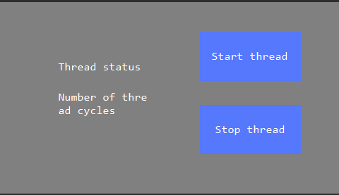

# Thread
 システムは、`pthread`をサポートします。`pthread`インターフェースを理解すると、` posix`インターフェースを使用してスレッドを実装することもできます。また、`pthread`のラッパークラスを提供します。ここでは、次の3つの部分が含まれます。

* Thread.h：Thread class
* Mutex.h：Mutex class
* Condition.h：Condition class

## 使い方
1. ヘッダファイルをインクルードした後、`Thread`クラスを継承して`virtual bool threadLoop（）`関数を実装します。また、必要に応じてreadyToRun（）関数を実装します。

  ```c++
    #include <system/Thread.h>
    
    class MyThread: public Thread {
    public:
      /**
       * After the thread is created successfully, this function will be called, and some initialization operations can be done 
       * in this function
       * return true   Continue thread
       *        false  Exit thread
       */
      virtual bool readyToRun() {
        LOGD("Thread has been created");
        return true;
      }

      /**
       * Thread loop function
       *
       * return true  Continue thread loop
       *        false Exit thread
       */
      virtual bool threadLoop() {
        LOGD("Thread loop function");

        //Check if there is a request to exit the thread, if so, return false and exit the thread immediately
        if (exitPending()) {
          return false;
        }

        //Accumulate the count and display it on the screen
        loop_count += 1;
        mTextView2Ptr->setText(loop_count);

        //To observation, add sleep 500ms here
        usleep(1000 * 500);

        //Return true, continue the next thread loop
        return true;
      }
    };
  ```

2. Thread objectインスタンス化
  ```c++
  static MyThread my_thread;
  ```
3. Thread開始
  ```c++
    //Call the run function of the thread class to start the thread
    //The parameter is the thread name, which can be arbitrarily specified.
    my_thread.run("this is thread name");
  ```
4. Thread終了
    `Thread`クラスは、同期または非同期の両方の関数としてthreadを終了することができ、違いは次のとおりです。
  * **void requestExitAndWait()**  
    ```c++
    //Request to exit the thread and wait. The function does not return until the thread completely exits
    my_thread.requestExitAndWait();
    ```
  * **void requestExit()**  
    ```c++
    //Request to exit the thread, the function returns immediately after sending the request but at this time, it does not mean 
    //that the thread has also exited
    my_thread.requestExit();
    ```

    上記の二つの関数のいずれかを呼び出した後`threadLoop`関数で`bool exitPending（）`のメンバー関数を使用してスレッド終了要求があるかを確認することができます。

    ```c++
    virtual bool threadLoop() {
      LOGD("Thread loop function");

      //Check if there is a request to exit the thread, if so, return false and exit the thread immediately
      if (exitPending()) {
        return false;
      }
      return true;
    }
    ```

    > [!Note]
    > 上記の関数は、threadを強制的に終了せずにthread終了を要求する表示を追加します。
    > `threadLoop`関数で特定のタスクを実行しており、`threadLoop`関数が終了していない場合は、threadが停止されません。
    > 正しいアプローチは、`threadLoop`でthread終了要求を確認するか、終了条件を確認し、`false`を返すことです。

---
   > [!Warning]
   > `threadLoop`関数で`requestExitAndWait`と`requestExit`関数を呼び出すことは、デッドロックを引き起こす可能性があり、禁止されています。

5. Threadが実行されていることを確認
  ```c++
  if (my_thread.isRunning()) {
    mTextView4Ptr->setText("Now running");
  } else {
    mTextView4Ptr->setText("Already stop");
  }
  ```

## Threadプロセス
 上記の手順をフローチャートと理解すれば、より簡単に深く理解できます。 


## Sample code  
詳細については、[Sample Code](demo_download.md＃demo_download)の`ThreadDemo`プロジェクトを参照してください。 
    


