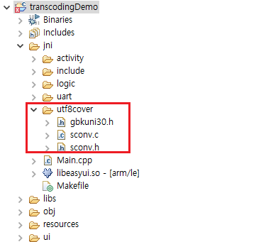

# UTF-8 encoding
 現在のシステムは、UTF-8エンコーディングのみをサポートします。たとえばText Viewのようなコントロールは、一般的に、UTF-8でエンコードされた文字列のみを表示することができます。したがって、他のコードを正常に表示するには、直接トランスコードする必要があります。

## sconv
  Sconvはトランスコーディングのためのオープンソースのライブラリでutf-8とgbk間の変換に使用されます。

## 준비
[sconvソースファイルのダウンロード](https://developer.flywizos.com/src/utf8cover.rar)、プロジェクト`jni`フォルダに解凍します。
  


## UTF-8 to GBK
1. 必要なヘッダファイル   
    ```c++
    #include <string>
    #include "utf8cover/sconv.h"
    ```

2. 함수 추가
    ```c++
    string utf8_to_gbk(const char* utf8_str) {
      int size = sconv_utf8_to_unicode(utf8_str, -1, NULL, 0);
      wchar *unicode = new wchar[size / 2 + 1];
      size = sconv_utf8_to_unicode(utf8_str, -1, unicode, size);
      unicode[size / 2] = 0;

      size = sconv_unicode_to_gbk(unicode, -1, NULL, 0);
      char *ansi_str = new char[size + 1];
      size = sconv_unicode_to_gbk(unicode, -1, ansi_str, size);
      ansi_str[size] = 0;

      string gbk(ansi_str, size);
      delete[] ansi_str;
      delete[] unicode;
      return gbk;
    }
    ```
3. 関数を使用してエンコード変換を実行します。例は次のとおりです。
    ```c++
      const char* utf8_str = "This is utf8 encoding";
      string gbk = utf8_to_gbk(utf8_str);
      LOGD("After conversion, a total of %d bytes", gbk.size());
      for (size_t i = 0; i < gbk.size(); ++i) {
        LOGD("%d byte = %02X", i, gbk.data()[i]);
      }
    ```


## GBK to UTF-8
1. 必要なヘッダファイル
    ```c++
    #include <string>
    #include "utf8cover/sconv.h"
    ```

2. 関数の追加
    ```c++
    string gbk_to_utf8(const char* gbk_str) {
      int size = sconv_gbk_to_unicode(gbk_str, -1, NULL, 0);
      wchar *unicode_str = new wchar[size / 2 + 1];
      size = sconv_gbk_to_unicode(gbk_str, -1, unicode_str, size);
      unicode_str[size / 2] = 0;
    
      size = sconv_unicode_to_utf8(unicode_str, -1, NULL, 0);
      char *utf8_str = new char[size + 1];
      size = sconv_unicode_to_utf8(unicode_str, -1, utf8_str, size);
      utf8_str[size] = 0;
      string utf8(utf8_str, size);
      delete[] unicode_str;
      delete[] utf8_str;
      return utf8;
    }
    ```
3. 関数を使用してエンコード変換を実行します。例は次のとおりです。
    ```c++
      //To testing, here is a gbk encoding array whose content is "This is gbk encoding"
      const char gbk_str[] = {0xd5, 0xe2, 0xca, 0xc7, 0x67, 0x62, 0x6b, 0xb1, 0xe0, 0xc2, 0xeb,0};
      string utf8 = gbk_to_utf8(gbk_str);
      LOGD("After conversion, a total of %d bytes", utf8.size());
      LOGD("Content is：%s", utf8.c_str());
    ```