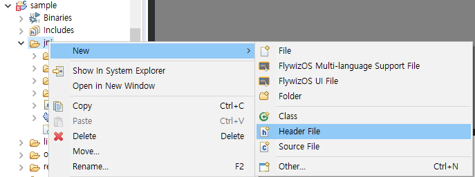

# EEPROM機能のエミュレーション
 EEPROM(電源が供給されて、読み取り - 書き込み可能なメモリ)は、ユーザーが変更できるメモリ（ROM）には、通常よりも高い電圧に削除と再プログラミング(再書き込み)を行うことができます。

## エミュレーション原理
 このシステムは、独自のファイルシステムがあるLinuxベースで保存されたデータを**NorFlash**に記録されます(削除回数が100,000回以上、**Nandfalsh**がありません。**NandFlash**は不良ブロックが発生した後、様々なリスクが発生する可能性があります)。
 **/data**パーティションは、ユーザーデータのためにFlywizOS内部に予約されています。マイクロコントローラの動作に慣れているユーザーの便宜のために **/data**パーティションの下にファイルを作成して、EEPROM空間をシミュレートします。(/dataパーティションのサイズは、特定のシステムのバージョンに応じて、1Mまたは数百KBの範囲)

## 使用シナリオ
電源がオフの状態でデータを保持します。

## 実装段階
1. まず、プロジェクトの** jni**ディレクトリにヘッダファイルを作成します。  
   プロジェクトで**jni**を選択し、マウスの右ボタンをクリックして、ポップアップコンテキストメニューから**New -> Header File**オプションを選択し、名前を**vireeprom.h**と指定して、[Finish]をクリックします。   
    
    

2. 追加したばかりのヘッダーファイルに次のコードをコピーします。(ヘッダファイルの作成時に、いくつかの内容が自動的に追加および削除することができます。)  
   このコードは、EEPROMのエミュレーション機能を実装します。
   ```c++
   #ifndef JNI_VIREEPROM_H_
   #define JNI_VIREEPROM_H_
     
   #include <stdio.h>
   #include <string.h>
   #include <unistd.h>
   /**
    * The storage size of the emulated EEPROM, in bytes, it is recommended not to be too large
    */
   #define EEPROM_SIZE 1024
   /**
    * Actually saved as a file /data/eeprom.eep
    */
   #define EEPROM_FILE  "/data/eeprom.eep"
   
   class VirEEPROM {
   
   public:
     VirEEPROM() {
       memset(buff_, 0, sizeof(buff_));
       file_ = fopen(EEPROM_FILE, "rb+");
       if (file_) {
         fread(buff_, 1, EEPROM_SIZE, file_);
         fseek(file_, 0, SEEK_END);
         int f_size = ftell(file_);
         //Adjust the file to a suitable size
         if (f_size != sizeof(buff_)) {
           ftruncate(fileno(file_), sizeof(buff_));
           fseek(file_, 0, SEEK_SET);
           fwrite(buff_, 1, sizeof(buff_), file_);
           fflush(file_);
           sync();
         }
       } else {
         file_ = fopen(EEPROM_FILE, "wb+");
         //Adjust the file to a suitable size
         ftruncate(fileno(file_), sizeof(buff_));
       }
     }
     virtual ~VirEEPROM() {
       if (file_) {
         fflush(file_);
         fclose(file_);
         sync();
       }
     }
     /**
      * Return : less than 0 is failure, greater than 0 is the actual number of bytes written
      * Parameter: The data pointer that value needs to save, which can be a structure pointer, char*, int*..., size is the
      * size of the data to be saved
      * Examples of use:
      * const char buff[]="12345678";
      * VIREEPROM->WriteEEPROM(0,buff,sizeof(buff);
      */
     int Write(int addr, const void* value, int size) {
       if (file_ == NULL) {
         return -1;
       }
       if ((addr >= EEPROM_SIZE) || ((addr + size) > EEPROM_SIZE)) {
         //Oversize
         return -2;
       }
       memcpy(buff_ + addr, value, size);
       if (0 != fseek(file_, addr, SEEK_SET)) {
         return -3;
       }
       int n = fwrite((char*)value, 1, size, file_);
       fflush(file_);
       sync();
       return n;
     }
     /**
      * Return : less than 0 is a failure, greater than 0 is the number of bytes actually read
      * Parameter: the data pointer to be read by value, which can be a structure pointer, char*, int*..., size is the size of
      * the data to be read
      * Examples of use:
      * char buff[9];
      * VIREEPROM->ReadEEPROM(0,buff,sizeof(buff);
      */
     int Read(int addr,void* value,int size) {
       if (file_ == NULL) {
         return -1;
       }
       if ((addr >= EEPROM_SIZE) || ((addr + size) > EEPROM_SIZE)) {
         //Oversize
         return -2;
       }
       memcpy(value, buff_ + addr, size);
       return size;
     }
     /**
      * Return：
      *     0    Success
      *     Less than 0 failed
      */
     int Erase() {
       if (file_ == NULL) {
         return -1;
       }
       if (0 != fseek(file_, 0, SEEK_SET)) {
         return -2;
       }
       memset(buff_, 0, sizeof(buff_));
       if (sizeof(buff_) != fwrite(buff_, 1, sizeof(buff_), file_)) {
         return -3;
       }
       fflush(file_);
    sync();
       return 0;
     }
      
     static VirEEPROM* getInstance() {
       static VirEEPROM singleton;
       return &singleton;
     }
   private:
   unsigned char buff_[EEPROM_SIZE];
      FILE* file_;
    };
    #define VIREEPROM  VirEEPROM::getInstance()
   
    #endif /* JNI_VIREEPROM_H_ */
    
   ```   
3. 今までの準備作業が完了したので、正常であるかをテストするために、いくつかの例を作成します。
   `mainLogic.cc`ソースファイルを開き、ファイルの先頭にある "**vireeprom.h**"ヘッダファイルをインクルードしてください。
    ```c++
    #include "vireeprom.h"
    ```
   
4. Test code   
    ```c++
    static void onUI_init(){
        //The value array, starting from address 0, is written sequentially
        char value[4] = {1, 2, 3, 4};
        VIREEPROM->Write(0, value, sizeof(value));

        //Start reading from address 0, read 4 bytes in sequence, and save the read content in buf
        char buf[4] = {0};
        VIREEPROM->Read(0, buf, sizeof(buf));
        //Output log
        LOGD("Data read : %02x, %02x, %02x, %02x", buf[0], buf[1], buf[2], buf[3]);
      
        //Clear all eeprom to 0
        VIREEPROM->Erase();
    }
    ```

   
