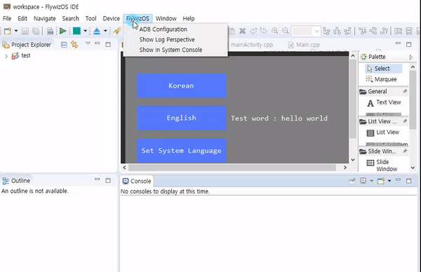

# ADB 다운로드 및 디버깅
FlywizOS는 USB또는 WIFI를 통해 프로그램을 빠르게 다운로드 할 수 있으며, 구체적인 단계는 다음과 같습니다.

## 먼저, 컴퓨터와 보드를 연결하는데, 여기에는 두 가지 방법이 있습니다.
> [!Note]
>
> ##### Note: 만약 WIFI가 내장된 보드를 구매하였다면, WIFI를 통해서만 연결이 가능합니다.(USB연결 불가)
>
> ##### WIFI가 없는 버전을 구매하였다면, USB를 이용해 컴퓨터를 연결하면 아래와 같이 연결 상태를 확인 가능합니다다.
>
> 

 1. 컴퓨터와 보드를 USB케이블을 이용하여 연결 - USB 케이블을 사용하여 컴퓨터와 기기를 연결합니다. 컴퓨터가 기기를 Android 장치로 인식 할 수 있으면 연결이 정상입니다. 정상적으로 연결할 수없는 경우 컴퓨터에 드라이버 문제가 표시됩니다. [드라이버 다운로드 및 설치](install_adb_driver.md)를 시도해보세요.

 2. WIFI를 통해 연결(이 방법은 보드가 WIFI를 지원해야 합니다.)   
    먼저 보드의 WIFI 설정을 통해 보드를 컴퓨터와 같은 네트워크에 연결합니다. 네트워크 설정 후 보드의 IP주소를 확인하고 해당 IP주소를 FlywizOS IDE의  설정하면 IDE는 보드와의 연결을 시도하여 성공할 시 성공 확인 팝업이 표시됩니다. (만약 실패한다면 보드의 IP주소가 정확한지 확인하십시오.)

    WIFI 설정 액티비티   
       
    
    IDE의 IP주소 설정   
      

## 다운로드 및 디버깅
위 과정을 완료되면 사용자는 프로그램 직접 보드에 다운로드 할 수 있습니다. 프로젝트 탐색기에서 다운로드 할 프로젝트의 이름을 선택 후 마우스 오른쪽 클릭을하여 팝업된 메뉴에서 **Download and Debug**를 찾아 클릭하면 자동으로 프로그램이 컴파일되고, 컴파일이 성공하면 보드에 프로그램이 다운로드됩니다. 이후 정상적으로 다운로드에 성공하면 보드에서 다운로드한 프로그램이 실행되는 것을 볼 수 있습니다. 

유사하게, 프로젝트 선택 후 **Ctrl + Alt + R**키를 누름으로 다운로드가 가능합니다.

[**로그를 이용한 디버깅**](logcat.md)

# 주의사항
* 만약 컴퓨터에 다른 안드로이드 디바이스가 연결되어 있다면 해당 기기의 연결을 해제해야 합니다.다. 그렇지 않을 경우 다운로드 실패의 원인이 될 수 있습니다.
    * **Note: 이 방법으로 프로그램을 실행할 경우 프로그램은 보드에 저장되지 않기 때문에 전원을 해제할 경우 다음 전원 연결 시 기존 보드에 내장되어 있는 프로그램으로 실행됩니다. (만약 프로그램을 보드에 저장하고 싶다면 ["업데이트 이미지 만들기"](make_image.md)  참고하십시오)**