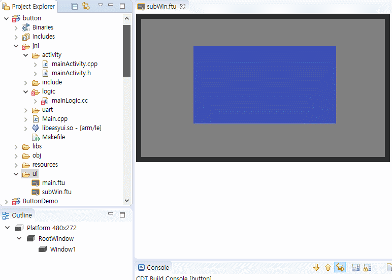
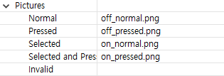

# 공통 속성
각각의 컨트롤을 소개하기 전에 컨트롤의 기본적인 공통 속성과 설정 값들을 알아보겠습니다.

## <span id = "widgetID">컨트롤 ID</span>
ID는 컨트롤에 대한 고유 식별자입니다. 각 ftu파일 안에서는 중복된 ID를 허용하지 않습니다. 다른 ftu파일 간에는 동일한 ID를 허용합니다.  
ID를 설정 후 컴파일하면 ftu파일에 해당하는 **activity**의 헤더파일이 생성되고, 해당 헤더파일 안에 컨트롤의 ID가 정의됩니다.  


**컨트롤로부터 ID가져오기**
```c++
/**
 * The interface is defined in the control base class "ZKBase"
 * Header file location: include/control/ZKBase.h
 *
 * Note: The following interfaces, unless otherwise specified, mean that all controls defined in the ZKBase class directly or   
 * indirectly inherit the ZKBase class, so all controls can call the public interface in the ZKBase class
 */
int getID() const;

/* Operation example: Click the button control to print the ID value of the control */
static bool onButtonClick_Button1(ZKButton *pButton) {
    int id = pButton->getID();
    LOGD("onButtonClick_Button1 id %d\n", id);
    return false;
}
```

## 컨트롤 위치
ftu파일에서 컨트롤을 선택하면 속성 창의 Location을 통해 컨트롤이 표시되는 위치를 결정할 수 있습니다.


왼쪽 상단 모서리의 좌표는 상위 컨트롤의 왼쪽 상단 모서리를 기준으로합니다. 컨트롤의 좌표는 코드를 통해서도 설정하거나 현재 설정된 좌표를 얻어올 수 있습니다.
```c++
/* Interface description */
// Set location
void setPosition(const LayoutPosition &position);
// Get location
const LayoutPosition& getPosition();


/* Operation esample */
// Click the button control to set the button position
static bool onButtonClick_Button1(ZKButton *pButton) {
    // left：0，top：0，width：100，height：200
    LayoutPosition pos(0, 0, 100, 200);
    pButton->setPosition(pos);
    return false;
}

// Click the button control to get the button position
static bool onButtonClick_Button2(ZKButton *pButton) {
    // The mLeft, mTop, mWidth, and mHeight variables of pos correspond to the coordinate values respectively.
    LayoutPosition pos = pButton->getPosition();
    return false;
}
```

## 배경색


비교적 간단합니다. 색상을 수정하여 효과를 확인하십시오.  
다음은 배경색을 설정하는 코드입니다.
```c++
/* When color is -1, the background is set to transparent; other color values are 0xRGB, and the color value does not support alpha */
void setBackgroundColor(int color);

/* Operation example : Click the button control and set the background color to red */
static bool onButtonClick_Button1(ZKButton *pButton) {
    pButton->setBackgroundColor(0xFF0000);
    return false;
}
```

## 배경 이미지


이미지를 선택하면 툴에서 바로 확인이 가능합니다.


아래는 코드를 통해 배경 이미지를 설정하는 방법입니다.
```c++
/**
 * The pPicPath parameter can have the following two ways :
 * 1. The absolute path, such as : "/mnt/extsd/pic/bg.png"
 * 2. Relative resource directory path, you only need to put the picture in the resources directory of the project, after 
 * compiling, you can use it. If there is a bg.png picture in the resource directory, just set "bg.png".
 */
void setBackgroundPic(const char *pPicPath);

/* Operation example */
mButton1Ptr->setBackgroundPic("/mnt/extsd/pic/bg.png"); // Set the absolute path
mButton1Ptr->setBackgroundPic("bg.png");    // Set the bg.png picture in the resource directory
```

## 표시 / 숨김


컨트롤의 기본 상태를 표시 또는 숨김으로 설정할 수 있습니다.   
Outline 창에서 해당 컨트롤을 더블 클릭하는 것으로 이 속성을 변경할 수 있습니다.



추가적으로 코드를 통해서도 표시/숨김의 속성 변경이 가능합니다.
```c++
void setVisible(BOOL isVisible);
BOOL isVisible() const;

/* Operation example */
mButton1Ptr->setVisible(TRUE);  // Show the button control
mButton1Ptr->setVisible(FALSE); // Hide the button control

/**
 * Window controls can also use the following interface, the same function
 * Header file location : include/window/ZKWindow.h
 */
void showWnd();  // Show window
void hideWnd();  // Hide window
bool isWndShow() const;  // Whether the window is displayed

/* Operation example */
mWindow1Ptr->showWnd();
mWindow1Ptr->hideWnd();
```

## 컨트롤 스테이트
텍스트, 버튼, 리스트 뷰 컨트롤은 5개의 스테이트(**Normal/Pressed/Selected/Pressed and Selected /Invalid state**)를 가지고 있으며, 아래는 각 스테이트에 대해 설명합니다.  

  

  



Pressed 스테이트는 별도로 코드에서 설정할 필요가 없이 터치를 통해 자동으로 변경됩니다.   
아래는 Selected와 Invalid스테이트에 대한 운영 예제입니다.
```c++
// Set selected state
void setSelected(BOOL isSelected);
BOOL isSelected() const;

/* Operation sample */
mButton1Ptr->setSelected(TRUE);
mButton1Ptr->setSelected(FALSE);

/**
 * Invalid state function description: when the control is set to the invalid state, the touch control has no effect, that is, 
 * it does not respond to the press and lift event
 */
// Set invalid state
void setInvalid(BOOL isInvalid);
BOOL isInvalid() const;

/* Operation example */
mButton1Ptr->setInvalid(TRUE);
mButton1Ptr->setInvalid(FALSE);
```

## 예제 설명
아래의 간단한 예제를 통해 공통 속성과 관련된 함수들에 대해 알아보겠습니다.

### 1. 컨트롤 생성
먼저 새로운 FlywizOS 프로젝트를 만들고, 프로젝트 탐색기에서 ui폴더의 main.ftu파일을 더블 클릭하여 엽니다. 그리고 우측의 컨트롤 박스에서 버튼 컨트롤과 텍스트 컨트롤을 main.ftu에 드래그하여 컨트롤을 생성합니다.


### 2. 프로젝트 컴파일
(더 자세한 사항은  ["FlywizOS 프로젝트 컴파일"](how_to_compile_flywizOS.md#how_to_compile_flythings) 참고하십시오)


### 3. 컨트롤 속성 함수 호출
컴파일이 끝난 후 프로젝트의 jni/logic/mainLogic.cc을 열면 파일의 하단부에  `onButtonClick_Button1`함수가 생성된 것을 확인할 수 있습니다.
**이 함수에 getID()함수를 호출하여 Button1 버튼 컨트롤의 ID 값을 가져오고 setText()함수를 호출하여 TextView1 텍스트 컨트롤에 표시합니다.**
([컨트롤ID와 컨트롤 포인터 변수의 관계에 대해 더 자세히 알고 싶다면 여기를 클릭하십시오.](named_rule.md))


### 4. 다운로드 및 디버깅
Project explorer에서 프로젝트 이름을 선택, 오른쪽 클릭 후 팝업 메뉴에서 **Download and Debug**를 선택하면 프로그램이 보드에 다운로드되고 실행됩니다. 프로그램 실행 후 버튼(Button1컨트롤의 버튼)을 눌러 텍스트 컨트롤에 버튼의 ID인 20001이 표시되는지 확인합니다.

### Note :
<font color="#E6161E" size="4">공통 속성의 설정 함수에 대해 더 알고 싶다면, /jni/include/control/ZKBase.h파일을 참고하십시오</font>   
