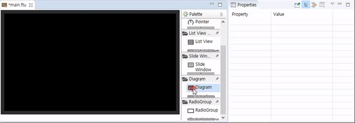
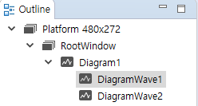
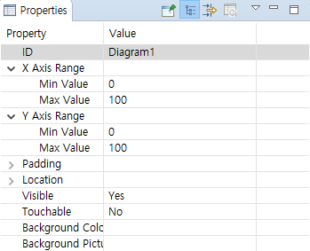
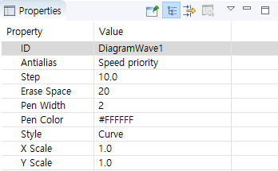
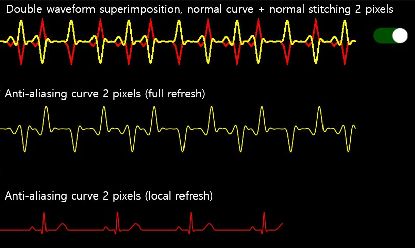

# 다이어그램
이 컨트롤을 사용하여 쉽게 곡선 또는 직선 다이어그램을 그릴 수 있습니다.

## 사용법
1. 먼저 UI파일에 다이어그램이 위치할 영역을 정한 후 **Diagram**컨트롤을 만들고, **Waveform**컨트롤을 추가하면 대략적인 다이어그램을 확인할 수 있습니다. 구체적인 생성 과정은 다음과 같습니다.

      
     
2. 필요한 경우 **Waveform**컨트롤을 추가하여 파형을 추가할 수 있습니다.   
   **Note : 프리뷰에서는 Diagram컨트롤에 있는 Waveform 컨트롤을 선택할 수 없기 때문에 Waveform컨트롤의 속성을 확인하거나 수정하기 위해서는 outline에서 waveform컨트롤을 선택할 수 밖에 없습니다.**

     

3. Diagram과 Waveform컨트롤 각각의 속성을 확인하면 Diagram컨트롤의 속성으로는 파형의 x, y좌표의 범위와 그려질 영역을 결정한다는 것을 알 수 있습니다. 그리고 Waveform컨트롤의 속성으로는 각 파형의 선 스타일을 결정합니다.

      

     

 Waveform컨트롤의 속성 중 `Step`과 `Erase Space`은 아래와 같습니다.

 * <span id = "step_property"> **Step** </span>  
    새로운 파형 데이터가 하나 추가되었을 때, 파형이 움직이는 거리(단위 : 픽셀)을 나타냅니다. 이 값은 **x-axis zoom**속성의 영향을 받습니다.
  * **Erase Space**  
    파형이 갱신 되었을 때 **빈** 부분의 넓이를 나타냅니다. 
         

**위의 두 가지 속성은 모두 `void addData(int index, float data)`함수를 이용해 새로운 파형 데이터를 추가 할 경우에만 유효합니다.**

## 좌표와 스케일
전체 파형의 스케일은 자동으로 결정되므로, 속성 창의 x축, y축의 범위와 표시 영역의 크기만을 결정하면 됩니다.
> Note : Waveform 컨트롤의 **X scale과 Y scale** 속성은 해당 값의 배율에 따라 파형이 스크린에 그려집니다. 기본은 1.0이며 스케일되지 않음을 의미합니다. 파형의 좌표는 **x-axis min value, x-axis max  value, y-axis min  value, and y-axis max  value**에 의해 결정됩니다. 예로, 기본 x-axis의 범위가 [0, 100]이고, y-axis의 범위가 [0,100]라면, 파형이 그려지는 영역의 좌표는 아래와 같습니다.
  

일반적으로 **x-axis min**  값은 **x-axis max** 의 값보다 작습니다. 그러나 반대로 값을 넣을 경우 파형은 동일한 데이터를 가진 파형이 x축으로 반전됩니다. 만약 `void setData(int index, const MPPOINT *pPoints, int count)`함수를 사용해서 데이타를 추가할 경우 갱신되는 방향 역시 반대 방향이 됩니다. 또한 이와 유사한 일이 y축에 발생한다면 위, 아래로 반전됩니다.

## 운영 코드
UI파일은 오직 파형의 형태만 빠르게 수정할 수 있고, 실제 파형은 코드를 통해 데이터를 추가해야 합니다.
프로젝트의 `jni/include/control/ZKDiagram.h`에서 이를 위한 지원 함수들을 찾아볼 수 있습니다.  
**Note : 다른 컨트롤과는 다르게, `Waveform`컨트롤 역시 ID를 가지고 있지만, 이 ID로 독립적인 포인터 변수가 만들어지지 않습니다. 오직 `Diagram`컨트롤만 독립적인 포인터 변수가 만들어집니다. 그러므로 파형을 조정하기 위해서는 `Diagram`컨트롤의 포인터를 이용하여 `index`값으로 파형을 조정해야 합니다. 
 `index`는 0부터 시작합니다.**

  * `void setPenWidth(int index, int width)`  
    파형의 두께를 설정합니다. 속성 창의 **Pen Width**에 해당합니다.
    
  * `void setPenColor(int index, ARGB color)`  
    파형의 색을 설정합니다. 속성 창의 **Pen Color**에 해당합니다.
    
  * `void setXScale(int index, double xScale)`  
    X-axis의 스케일을 설정합니다. 속성 창의 **X-axis Xcale**에 해당합니다.
    
  * `void setYScale(int index, double yScale)`  
    Y-axis의 스케일을 설정합니다. 속성 창의 **Y-axis Scale**에 해당합니다.
    
  * `void setData(int index, const MPPOINT *pPoints, int count)`      
    ```c++
    typedef struct _MPPOINT
    {
        float x;
        float y;
    }MPPOINT;
    ```
    `MMPOINT`구조체는 파형 데이터의 x와 y값을 포함합니다.
    이 함수는 `index`번 째 Waveform컨트롤에 `count`개의 데이터를 가지는 `pPoints`배열로 파형을 그리라는 의미입니다.(Note : `count`값은 `pPoints`의 실제 크기보다 클 수 없습니다.)  
    **이 함수를 이용해 파형을 그리는 경우** : 먼저 `sPoints`배열에 파형 데이터를 채우고 한 번에 파형을 갱신합니다. 그러므로 만약 파형을 왼쪽이나 오른쪽으로 움직이는 효과를 얻고 싶다면 배열 전체의 값을 조정해야 합니다. 보통 이러한 경우 타이머를 사용하여 구현하며, 이 함수 호출 시 전체 파형이 갱신됩니다.
    
  * `void addData(int index, float data)`
    파형에 하나의 데이터를 추가합니다. `data`는 y값이며 x값은 [**Step**](#step_property)에 의해 자동으로 결정됩니다. `void setData(int index, const MPPOINT *pPoints, int count)` 와 `void addData(int index, float data)` 의 파형 갱신 방식을 비교하자면, 데이타의 사이즈가 클 경우에는 2번째 방법이 더 효율적으로 파형을 갱신할 수 있습니다.
    
  * `setData(index, NULL, 0)`     
    파형 데이타를 전부 0으로 클리어합니다.
    
## 파형 이동 방법 추가
위에서 보았 듯 `void setData (int index, const MPPOINT * pPoints, int count)`를 사용하여 파형을 그리는 경우 일반적으로 배열의 값을 직접 설정해야합니다.
```c++
static void movePoints(MPPOINT* p,int size){
	for(int i =0;i < size-1;i++){
		p[i].y = p[i+1].y;
	}
	p[size-1].y = 0;
}
```

## 타이머를 추가하여 파형 데이터를 주기적으로 갱신
일반적으로 주기적인 파형 갱신을 위해 가장 손쉬운 방법으로 타이머를 추가합니다.

# 예제 코드
프리뷰  
  

구체적인 내용은 [예제 코드](demo_download.md#demo_download)의 DiagramDemo 프로젝트 참고하십시오.