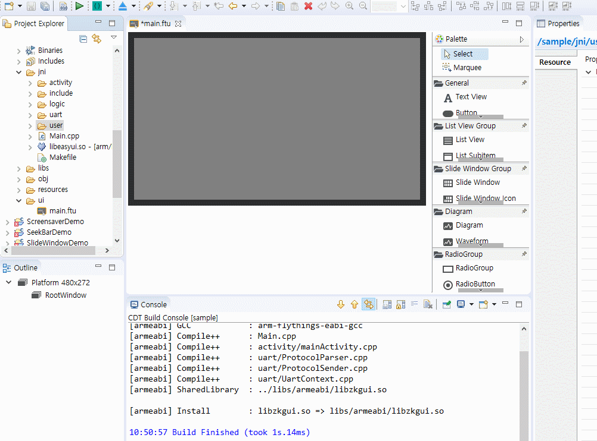

# FlywizOS 프로젝트 컴파일
FlywizOS 프로젝트를 컴파일 하는 것은 매우 간단하며, 3가지 방법이 있습니다.

## 1. Project Explorer에서 컴파일
Project Explorer에서 컨파일하려는 프로젝트를 찾아 선택하고 마우스 오른쪽 클릭하여 팝업되는 메뉴에서 **Compile Project**를 선택하면 자동으로 프로젝트가 컴파일됩니다. 아래는 관련 동영상입니다.

   

## 2. Toolbar에서 컴파일
IDE의 상단부 툴바에 컴파일 단축키가 있습니다. 1과 유사하게 Project Explorer에서 컴파일하려는 프로젝트를 찾아 선택하고 해당 버튼을 누르면 컴파일이 진행됩니다.  

   
프로젝트 선택 후 녹색의 삼각형을 클릭하면 컴파일이 진행됩니다.

## 3. 단축키로 컴파일
가장 간단한 방법으로 코딩 중 **Ctrl + Alt + Z**를 누르면 빠르게 컴파일이 진행됩니다.

# 프로젝트 클린 업
프로젝트 컴파일 후, 일반적으로 오브젝트 파일과 임시 파일들이 남게됩니다. 예를 들어 컴파일 시간이 단축을 위해 **libs**와 **obj** 폴더가 남겨집니다.

  
개발자는 이것들을 수동으로 삭제할 수도 있고, 메뉴를 통해 자동으로 삭제할 수도 있습니다.

* 수동 삭제  
  먼저 삭제하려는 폴더를 선택하고 마우스 오른쪽 버튼을 클릭하여 팝업되는 메뉴에서 **Delete**를 선택하여 삭제합니다.

  

* 자동 삭제  
  만약 매번 수동으로 삭제한다면, 다른 중요한 파일을 삭제하는 등의 실수가 발생할 수 있습니다. 그러므로 자동 클린업으로 이러한 상황을 방지하십시오.
  먼저 프로젝트의 이름을 선택하고 마우스 오른쪽 클릭을하여 팝업되는 메뉴에서 **Clear Project**를 선택합니다. 그러면 자동으로 **libs**와 **obj** 폴더가 삭제됩니다. (이 경우 폴더 안의 파일들은 삭제되지만, 폴더 자체가 삭제되지는 않습니다.)

**Note: 만약 컴파일 중 이상한 문제가 발생하거나, 프로그램에서 소스가 컴파일되지 않는다면 먼저 Clear Project를 실행하고, 다시 컴파일을 수행해 보십시오. 특히 다른 사람의 프로젝트를 가져와서 컴파일 하는 경우 종종 이러한 현상이 발생할 수 있습니다.**

# Recompile
만약 코드를 다시 컴파일하고 싶다면, 먼저 프로젝트를 클린업하고 컴파일을 하십시오.

