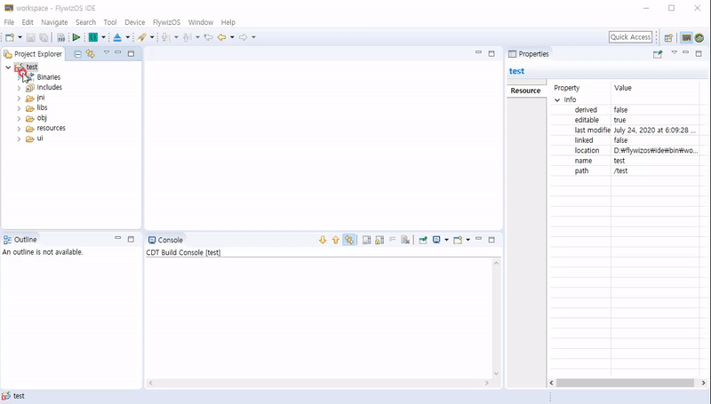

## 다중 언어
FlywizOS는 다중 언어를 지원합니다.
### 사용법
1. 먼저 new wizard를 통해 다중 언어를 위한 파일을 생성합니다.
   
   
   
2. 파일 생성 후, 프로젝트 폴더에 **i18n** 폴더가 생성되고 기본적인 **tr**파일들이 생성될 것입니다. 각 **tr**의 파일 이름은 해당하는 언어를 나타냅니다.(파일 이름은 임의로 바꾸지 않을 것을 권장합니다.)

3. tr파일을 더블 클릭으로 오픈하면 xml포맷으로 된 컨텐츠를 볼 수 있습니다. 여기서 string tag의 **name**은 alias로 사용되고, 코드상에서 문자열을 대표합니다.
 > Note : 동일한 tr파일에서 alias는 중복될 수 없습니다.

~~~xml
<?xml version="1.0" encoding="utf-8"?>
<resources>
    <string name="hello_world">Hello world!</string>
    <string name="hello_flywizos">Hello, FlywizOS</string>
</resources>
~~~
  만약 문자열에 줄바꿈을 원한다면 `&#x000A;`을 추가하십시오. 아래는 예제입니다.
~~~xml
<?xml version="1.0" encoding="utf-8"?>
<resources>
    <string name="new_line_test">first line&#x000A;second line</string>
</resources>
~~~

 위에서 문자 **"hello, world!"**의 alias를 `hello_world`로 그리고 문자 **"hello, FlywizOS"**의 alias를 `hello_flywizos`로 정했습니다. 만약 더 많은 문자열과 alias를 추가하고자 한다면 예제의 `string` tag 를 참고하십시오.

4. 다중 언어를 위해 각 언어에 동일한 `name` tag를 추가합니다. 이러한 방법으로, 설정 언어를 바꿨을 때 시스템은 자동으로 해당 언어에 해당하는 동일 `name` tag의 문자로 교체됩니다. 
5. 언어 파일이 추가된 후 개발자는 UI파일과 코드에서 그것을 사용할 수 있습니다. 

6. UI파일을 열고, 컨트롤의 속성 중 Text에 **@hello_world**를 입력한 후 보드에 다운로드하여 실행하면, 해당 컨트롤에 **Hello, world! **가 표시되는 것을 확인할 수 있습니다.(**@** 심볼은 @뒤의 텍스트가 언어 파일의 alias임을 나타냅니다) 

      

7. 또한 코드상에서도 동일하게 alias를 사용할 수 있습니다. `setTextTr()` 함수가 바로 그 방법입니다.
    예 :    
 ```c++
/**
 * Triggered when the activity is constructed
 */
static void onUI_init() {
	// The parameter of setTextTr() is the name value in the language file. Note: The string passed in here does not need to be
    // preceded by the @ symbol
	mTextview1Ptr->setTextTr("hello_world");
}
 ```
 프로그램을 보드에 다운로드 후 실행하면 해당 컨트롤에 alias에 해당하는 문자가 표시되는 것을 확인할 수 있습니다.

8. 또한 언어 파일의 alias를 이용하여 컨텐츠를 가져올 수 도 있습니다. 예:

```c++

#include "manager/LanguageManager.h"

static bool onButtonClick_Button1(ZKButton *pButton) {
    //LOGD(" ButtonClick Button1 !!!\n");
    std::string hello = LANGUAGEMANAGER->getValue("hello");
    std::string world = LANGUAGEMANAGER->getValue("world");
    std::string ret = hello + " " + world;
    LOGD("ret: %s\n", ret.c_str());
    return false;
}

```


### 언어 변경

1. 시스템의 기본 언어는 **zh_CN** (Simplified Chinese)입니다.
2. 시스템에 내장된 언어 설정 액티비티를 통해 언어를 변경할 수 있습니다.  
아래 코드는 언어 설정 액티비티를 실행하는 예제입니다.
```c++
EASYUICONTEXT->openActivity("LanguageSettingActivity");
```
또는 제공되는 API 함수를 통해서도 언어를 자유롭게 변경할 수 있습니다.

   ```c++
     EASYUICONTEXT->updateLocalesCode("zh_CN"); //Set to Chinese
     EASYUICONTEXT->updateLocalesCode("en_US"); //Set to English
     EASYUICONTEXT->updateLocalesCode("ko_KR"); //Set to Korean
   ```


### 폰트 요구사항       

 다중 언어는 폰트의 지원이 필요합니다. 만약 해당 문자가 폰트에 없다면 비 정상적으로 표시될 것입니다. 그러므로 사용되는 폰트도 다중 언어를 포함하고 있어야 합니다.
   > 시스템의 기본 폰트는 간체 중국어입니다. 다중 언어를 위해 커스텀 폰트를 추가하는 것을 권장합니다. [Font cutting](font_cut_tool.md)을 참고하십시오.


### 예제

전체 소스는 [**예제 코드**](demo_download.md#demo_download)의 **TranslationDemo**를 참고하십시오.


