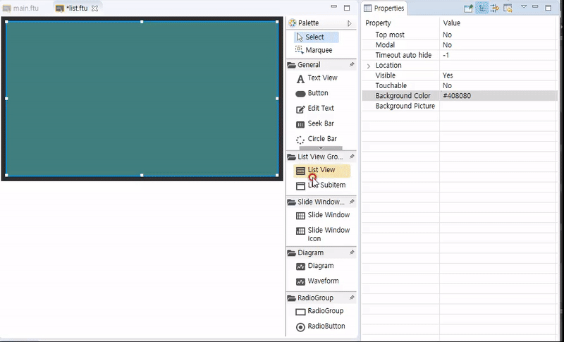
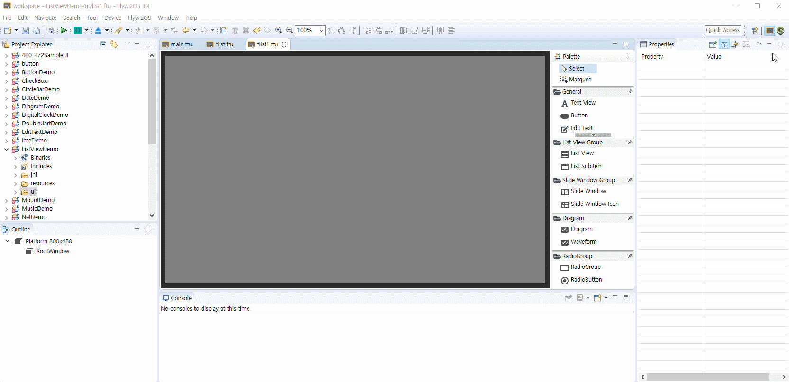

# List control
## 기능
 리스트 컨트롤은 한 페이지에 모든 정보를 표시할 수 없을 경우 그리고 어떤 정보들이 일정한 속성으로 분류될 필요가 있을 때 자주 사용됩니다.

## 예
WiFi 리스트, device 리스트, table 정보 등

## 사용법
1. UI파일을 열어 **List View** 컨트롤을 만듭니다. 그리고, 2개의 **List Subitem** 컨트롤을 추가합니다. 아래는 동영상 예제입니다.
    

2. 만들어진 리스트를 선택하면 아래와 같이 속성을 확인할 수 있습니다.
       

    각각의 속성을 수정해보고 보드에 다운로드하여 어떻게 변하는지 확인해 볼 수 있습니다.   
3. 이제 Outline을 살펴보겠습니다.   
    

    먼저 **List1**을 보면 리스트의 행과 열을 나타내는 **Item** 노드가 기본적으로 포함되고, 여기에는 추가했던 **ListSub**노드 2개가 포함된 것을 확인할 수 있습니다.    
    여기서 각 아이템 노드들을 클릭하면 속성 창에서 관련된 속성들과 그 속성이 영향을 미치는 범위를 에디터 영역의 프리뷰에서 확인 할 수 있습니다.  
    **Note : 각 List View 컨트롤은 최대 32개의 List item을 가질 수 있습니다. **

    **Item**과 **List Subitem**컨트롤은 **Button**컨트롤과 유사한 속성들을 가지고 있습니다.
    개발자는 원하는 스타일에 맞게 해당 속성들을 수정할 수 있습니다.  아래는 예제를 이용해 수정한 결과입니다 : 

      
4. UI파일에서 리스트의 전반적인 속성을 조정하여 표시되는 모양를 확인한 후 컴파일 하십시오[(FlywizOS 프로젝트 컴파일)](how_to_compile_flywizOS.md#how_to_compile_flywizOS). 그 후 자동으로 생성되는 상관 함수에 필요한 기능들을 추가 하십시오.
5. 컴파일이 끝나면 해당하는 Logic.cc파일에 각 리스트 컨트롤과 관련된 3가지 함수가 생성될 것입니다.
     *  `int getListItemCount_ListView1()`： 그려질 리스트 컨트롤의 아이템 수  
           예 : 100개의 아이템을 디스플레이 한다면, 100이 리턴됩니다.
     *  `void obtainListItemData_List1`： 리스트의 각 아이템에 표시될 컨텐츠를 설정
        예 : For specific examples, see follow-up documents
       위 두 함수는 리스트의 컨텐츠를 공동으로 제어합니다.
     *  `onListItemClick_List1`： 리스트 컨트롤 클릭 이벤트 함수
       리스트 상의 아이템을 클릭 시 시스템은 이 함수를 호출합니다. 그리고 파라미터로 현재 클릭된 리스트 아이템의 인덱스를 전달합니다.

## List drawing 과정
  1. 리스트를 그리기를 원할 때, 시스템은 먼저 리스트에 총 몇 개의 아이템이 있는지 알 필요가 있고, 이를 위해 제공된 `int getListItemCount_ListView1()`함수를 통해 총 아이템 수를 얻습니다. 이 함수는 동적으로 획득됩니다. 따라서 프로그램이 동작하는 중, 필요한 따라 다른 값을 리턴함으로 리스트의 아이템 수를 동적으로 조정할 수 있습니다.  

  2. 그 후, 시스템은`int getListItemCount_ListView1()`로 리턴된 수 만큼 `void obtainListItemData_ListView1(ZKListView *pListView,ZKListView::ZKListItem *pListItem, int index)` 함수를 호출하고, 호출 시 파라미터로 전달되는 포인터를 이용하여 각 아이템의 컨텐츠를 설정할 수 있습니다.

      
* **Example 1. 리스트 아이템에 표시할 컨텐츠 설정**
  ~~~C++
  static void obtainListItemData_ListView1(ZKListView *pListView,ZKListView::ZKListItem *pListItem, int index) {
      //The pListItem pointer represents a list item, which can only be used in this function
      char buf[32] = {0};
      //The parameter index indicates which item of the list is currently drawn, starting from 0.
      //Here, we format the index value into a string
      snprintf(buf, sizeof(buf), "Item %d", index);
      //Display the string as text in the list item area
      pListItem->setText(buf);
      //If you have configured the list item "Picture when selected" in the ui file,
      //Then, by setting the selected state of the list item through the following line of code, you can control the list item to
      //display the corresponding state picture
      pListItem->setSelected(true);
  }
  ~~~
* **Example 2. 리스트 서브 아이템에 표시할 컨텐츠 설정**  
만약 리스트 서브 아이템을 사용한다면 아래 방법처럼 리스트 아이템 컨트롤 포인터로부터 서브 아이템의 컨트롤 포인터를 획득해서 조정할 수 있습니다.
  ~~~C++
  static void obtainListItemData_ListView1(ZKListView *pListView,ZKListView::ZKListItem *pListItem, int index) {
      char buf[32] = {0};
      //The parameter index indicates which item of the list is currently drawn, starting from 0.
      //Here, we format the index value into a string
      snprintf(buf, sizeof(buf), "The first child of item %d", index);
      //We can get the pointer of the list item through the findSubItemByID() function and the ID of the list item
      //Same as the pListItem pointer, the list item pointer that is found can only be used in this function
      ZKListView::ZKListSubItem* subitem1 = pListItem->findSubItemByID(ID_MAIN_SubItem1);
      if (subitem1 != NULL) {
          //Set the text of list item 1
          subitem1->setText(buf);
      }

      snprintf(buf, sizeof(buf), "The second child of item %d", index);
      ZKListView::ZKListSubItem* subitem2 = pListItem->findSubItemByID(ID_MAIN_SubItem2);
      if (subitem2 != NULL) {
          //Set the text of list item 2
          subitem2->setText(buf);
      }
  }
  ~~~


## 리스트의 수정

 FlywizOS 시스템에서 리스트는 일련의 규칙적인 데이터의 매핑입니다. 만약 데이터를 추가하거나 특정 아이템을 수정하는 것 처럼 리스트를 수정하기 원한다면 먼저 데이터를 수정하고 리스트를 갱신합니다. 그러면 시스템은 자동적으로 ` obtainListItemData_ListView1` 함수를 호출하고, 이 함수로 최종적으로 수정된 데이터에 따라 리스트를 표시합니다.  
 이러한 과정은 아래 예제에 반영되어 있습니다.

## 예제 코드
[예제 코드](demo_download.md#demo_download)의 ListViewDemo 프로젝트를 참고하십시오.

### 예제 설명
1. List View 컨트롤을 생성
서로 다른 속성을 가지는 2개의 List View 컨트롤을 만듭니다.
**Cycle List control :** Cycle 속성을 on 합니다.

    

2. 프로젝트 컴파일
이 단계는 **Logic.cc** 파일에 자동으로 List View컨트롤과 관련된 함수를 생성합니다.  
["FlywizOS 프로젝트 컴파일"](how_to_compile_flywizOS.md#how_to_compile_flythings)을 참고하십시오.

3. List1 리스트 생성에 필요한 데이터 구조체 설정  
    일반적으로 리스트의 각 아이템을 위한 모델로 구조체를 정의합니다.
    ```c++
    typedef struct {
        //The text displayed in the list item
      const char* mainText;
        //The text to be displayed in list sub item 1
      const char* subText;
        //Turn on/off logo
      bool bOn;
    } S_TEST_DATA;
    ```
    가상의 리스트 데이터를 위한 구조체 배열을 정의합니다.
    ```c++
    static S_TEST_DATA sDataTestTab[] = {
      { "Test1", "testsub1", false },
      { "Test2", "testsub2", false },
      { "Test3", "testsub3", false },
      { "Test4", "testsub4", true },
      { "Test5", "testsub5", false },
      { "Test6", "testsub6", true },
      { "Test7", "testsub7", false },
      { "Test8", "testsub8", false },
      { "Test9", "testsub9", false },
      { "Test10", "testsub10", false },
      { "Test11", "testsub11", false }
    };
    ```

4. 자동으로 생성된 리스트 관련 함수에 코드를 추가합니다.
    ```c++
    static int getListItemCount_List1(const ZKListView *pListView) {
        //Use the length of the array as the length of the list
        return sizeof(sDataTestTab) / sizeof(S_TEST_DATA);
    }

    static void obtainListItemData_List1(ZKListView *pListView,ZKListView::ZKListItem *pListItem, int index) {
        //Get the pointer of the list sub item 1 and name it psubText
        ZKListView::ZKListSubItem* psubText = pListItem->findSubItemByID(ID_MAIN_ListSub1);
        //Get the pointer of the list sub item 2 and name it psubButton
        ZKListView::ZKListSubItem* psubButton = pListItem->findSubItemByID(ID_MAIN_ListSub2);
        pListItem->setText(sDataTestTab[index].mainText);
        //Take index as the subscript, get the corresponding structure from the array, get the text that needs to be displayed 
        //from the structure, and finally set it to the corresponding list item
        psubText->setText(sDataTestTab[index].subText);
        //In the UI file, we set the selected image property for the list sub item 2
        //Here, according to the `bOn` value of the structure, the selected state of the list item is set, so that if the member
        //`bOn` is true, it is set to be selected, and the system will automatically display the selected picture previously set
        psubButton->setSelected(sDataTestTab[index].bOn);
    }

    static void onListItemClick_List1(ZKListView *pListView, int index, int id) {
        //When you click the index item in the list, modify the bOn variable to reverse bOn. In this way, every time you click on
        //the list, the picture will switch once
        //Note that the operation of picture switching is completed in the obtainListItemData_List1 function, and now we only 
        //modify the value of this variable.
        sDataTestTab[index].bOn = !sDataTestTab[index].bOn;
        //The last sentence of code modified the structure data, and now we want to refresh the list immediately, and call
        //refreshListView to force a refresh
        //After the refresh is triggered, the system will call the two functions getListItemCount_List1 and 
        //obtainListItemData_List1 again, so that the modified data corresponds to the list display.
        mList1Ptr->refreshListView();
    }
    ```
5. 코드 추가가 완료되면 다운로드하여 실행 후 결과를 확인합니다.
