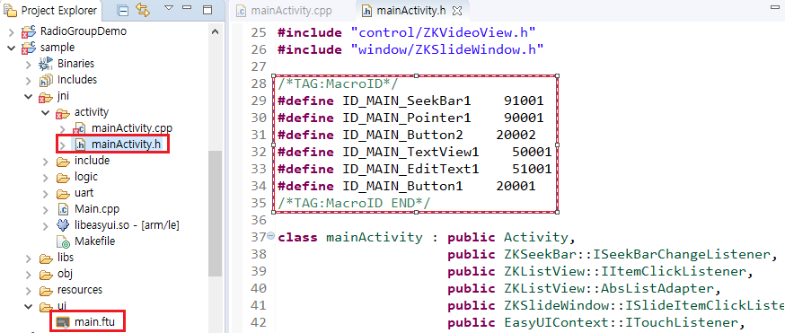
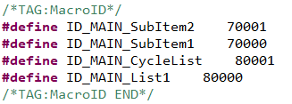

# Naming 규칙
 UI파일에 추가한 대부분의 컨트롤은 컴파일 후 관련된 포인터 변수와 매크로 ID가 자동으로 생성됩니다.
## <span id="id_name_rule">컨트롤 ID와 포인터 변수 이름를 위한 Naming 규칙</span>

 포인터 변수 이름은 각기 고정된 소문자 prepix **m** + **ID** 값+ **Ptr**의 세 개의 파트로 구성됩니다. 
 ID로 **Textview1**을 가지는 컨트롤을 예로 들어보겠습니다.

 

 컴파일 후 해당하는 포인터 변수의 이름은 **`mTextview1Ptr`**로 생성됩니다.

  

 포인터 변수의 class는 컨트롤에 의해 결정됩니다. 각 컨트롤에 해당하는 포인터 class는 아래와 같습니다.
 (프로젝트의 **jni/include**폴더에서 각 class의 헤더파일을 찾을 수 있습니다.)

| Control name | Class name 
|:--------:|:-------:
|    | ZKQRCode  | 
|    | ZKEditText   |
|    | ZKButton    |
|     | ZKTextView   |
|    | ZKSeekBar   | 
|    | ZKPointer   | 
|    | ZKCircleBar   | 
|    | ZKDigitalClock   | 
|    | ZKVideoView   | 
|    | ZKCameraView   | 
|  | ZKWindow |
|  | ZKListView |
|   | ZKSlideWindow |
|   | ZKDiagram |

## <span id="id_macro_rule">컨트롤 ID와 macro definition의 naming 규칙</span>
 이 macro definitiond은 UI파일에서 컨트롤의 매핑 관계를 나타냅니다.
 Macro definition은 고정된 대문자 `ID`, 대문자 UI 파일 이름, 컨트롤 ID property의 값의 세 파트로 구성됩니다. 
 ID를 **Textview1**로 가지는 컨트롤의 예를 보겠습니다.

 

컴파일 후, 해당하는 macro statement는 ** `#define ID_MAIN_TextView1 50001` **로 생성됩니다.



> [!Warning]
> Macro definition의 값을 수정하지 마십시오. 그렇지 않으면 비 정상동작의 원인이 될 수 있습니다.

## <span id = "relation_function">컨트롤에 의해 생성되는 연관 함수</span>
 어떤 컨트롤들은 연관된 함수를 자동으로 생성할 것입니다. 아래는 이러한 컨트롤들에 의해 자동으로 생성된 함수들에 대한 설명입니다.
> [!Note]
>  **함수에서 `XXXX`는 컨트롤의 ID 값입니다.**

* ### Button 컨트롤
   ```c++
   static bool onButtonClick_XXXX(ZKButton *pButton) {
      return false;
   }
   ```
   버튼이 클릭되면 호출되는 함수입니다.
   
     * **파라미터 `ZKButton *pButton`**은 클릭된 버튼의 포인터이고, 포인터의 멤버 변수들을 통해 일련의 operation을 수행할 수 있습니다. 이 포인터는 전역 변수 `mXXXXPtr`가 가리키는 객체와 동일한 객체의 포인터입니다.

* ### Edit Text 컨트롤
  ```c++
  static void onEditTextChanged_XXXX(const std::string &text) {
    
  }
  ```
Input box가 변경되었을 때, 시스템에 의해 자동적으로 호출되는 함수입니다.
  
  * **파라미터  `std::string &text`** 는 현재 Input box의 contents입니다.
  
* ### Seek Bar 컨트롤
  ```c++
  static void onProgressChanged_XXXX(ZKSeekBar *pSeekBar, int progress) {
  
  }
  ```
 Seek Bar의 프로그래스 값이 변경되면, 시스템에 의해 자동으로 호출되는 함수입니다.
  * **파라미터 `ZKSeekBar *pSeekBar`**는  Seek Bar의 포인터 변수이고, 포인터의 멤버 변수들을 통해 일련의 operation을 수행할 수 있습니다.  
  * **파라미터 `int progress`**는 현재 Seek Bar의 프로그래스 값입니다.

* ### <span id = "slidewindow"> Slide window 컨트롤</span>
  ```c++
  static void onSlideItemClick_XXXX(ZKSlideWindow *pSlideWindow, int index) {
    
  }
  ```
  
  Slide window컨트롤의 아이콘이 클릭되었을 때, 시스템에 의해 자동으로 호출되는 함수입니다.
  
    * **파라미터 `ZKSlideWindow *pSlideWindow`**는 Slide window 컨트롤의 포인터 변수이고, 포인터의 멤버 변수들을 통해 일련의 operation을 수행할 수 있습니다.  
    * **파라미터 `int index`**는 현재 클릭된 아니콘의 index 값입니다. 예를 들어, Slide window에 총 10개의 아이콘을 추가했다면 index 값의 범위는 [0, 9]입니다.
  
* ### <span id = "list">List 컨트롤</span>   
리스트 컨트롤은 가장 복잡한 컨트롤로 세 개의 연관된 함수를 생성합니다. 비록 많은 함수들이 있지만 아래 단계에 따라하면 쉽게 이해할 수 있습니다.   
  1. 먼저, 만약 시스템이 리스트 컨트롤을 그리기 원하면, 얼마나 많은 아이템이 있는지 알아야합니다.
     아래는 그와 관련된 함수입니다.   
     ```c++
     static int getListItemCount_XXXX(const ZKListView *pListView) {
      
           return 0;
     }
     ```
     * **파라미터 `const ZKListView *pListView`**는  List 컨트롤의 포인터이고, 전역 변수 `mXXXXPtr`와 동일한 객체를 가리킵니다.
     * **리턴 값**은 정수이고 리스트에 있는 아이템의 수를 나타내며, 필요에 따라 결정됩니다.

  
  2. 시스템이 리스트의 아이템 수를 알아냈지만 이것만으로 리스트를 그리기에는 부족하고 각 아이템에 어떤 컨텐츠를 표히해야하는지도 알아야합니다. 그래서 아래의 함수가 있습니다. 표시하려는 아이템의 수 만큼 아래 함수가 호출되어 표시할 내용을 설정하게됩니다.
     ```c++
       static void obtainListItemData_XXXX(ZKListView *pListView,ZKListView::ZKListItem *pListItem, int index) {
         //pListItem->setText(index)
     }
     ```
     * **파라미터 `ZKListView *pListView`**는  List 컨트롤의 포인터이고, 전역 변수 `mXXXXPtr`와 동일한 객체를 가리킵니다.

     * **파라미터 `ZKListView::ZKListItem *pListItem`**는 리스트 아이템의 포인터이고 UI파일에서 `Item`에 해당합니다.

     * **파라미터 `int index`**는 전체 리스트에서 `pListItem`의 index 값입니다.  
      **예 : ** `getListItemCount_XXXX`함수의 리턴 값이 10이라는 의미는 리스트에 10개의 아이템이 있고, `index` 값의 범위가 [0, 9]라는 것입니다.  
      `pListItem` 과 `index`를 연결하여 전체 리스트에서 어떤 아이템을 설정해야 할지 알 수 있습니다.
     
     이 함수에서 `index`에 따라 각 아이템에 표시될 컨텐츠가 설정될 수 있습니다.      
  
  3. 버튼 컨트롤과 유사하게, 리스트 컨트롤 역시 클릭 이벤트를 위한 함수를 가지고 있고, index 값을 기반으로 현재 어떤 아이템이 클릭되었는지 판단합니다.
     ```c++
     static void onListItemClick_XXXX(ZKListView *pListView, int index, int id) {
         //LOGD(" onListItemClick_ Listview1  !!!\n");
     }
     ```
      리스트 컨트롤이 클릭되면, 시스템은 클릭된 위치에 해당하는 아이템의 index값을 계산하여 자동으로 이 함수를 호출합니다.
  
     * **파라미터 `ZKListView *pListView`**는 List 컨트롤의 포인터이고, 전역 변수 `mXXXXPtr`와 동일한 객체를 가리킵니다. 

     * **파라미터 `int index`**는 전체 리스트 컨트롤에서 현재 클릭된 아이템의 index 값입니다.

     * **파라미터 `int id`**는 현재 클릭된 컨트롤의 ID입니다. 이 ID는 properties에 있는 ID와는 다르니 주의하십시오.   

     이에대한 macro definition은 해당하는 `Activity.h` 파일에 있습니다.  `mainActivity.h`를 예로 들면 아래와 같습니다.   
       
     이 ID 파라미터의 함수는 list item에 여러개의 subitem이 있을 경우 현재 클릭된 subitem이 어떤 것인지를 구분하는데 사용될 수 있습니다.    
     **예 :** 아래 그림에서 보이는 것처럼, list item에 스위치 이미지가 배치된 2개의 subitem이 추가되어 되었고, 각각의 property ID는 `SubItem1`과  `SubItem2` 입니다. `SubItem1`이 클릭되었을 때, 파라미터 `id`와 `ID_MAIN_SubItem1` 그리고  `ID_MAIN_SubItem2`의 관계로 판단될 것이며 어떤 스위치가 클릭되었는지 결정할 수 있습니다.
     ```c++
      static void onListItemClick_XXXX(ZKListView *pListView, int index, int id) {
          //LOGD(" onListItemClick_ Listview1  !!!\n");
          switch(id) {
          case ID_MAIN_SubItem1:
              //LOGD("Clicked the first subitem of item %d in the list", index);
              break;
          case ID_MAIN_SubItem2:
              //LOGD("Clicked the second subitem of item %d in the list", index);
              break;
        }
      }
     ```
     
    

**끝으로, 그림을 이용해서 그들 사이의 규칙을 요약해보겠습니다.**


다른 컨트롤도 이와 동일합니다.
