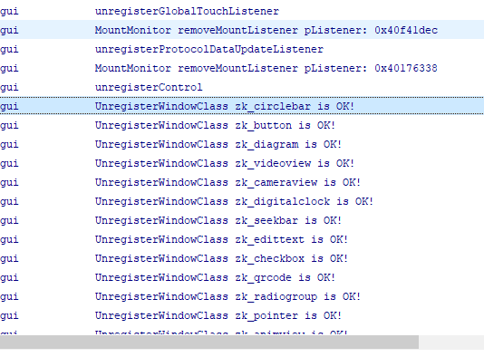

# FAQ
* ### 다운로드 및 디버그 불가능 / 다운로드 및 디버그 실패
  먼저 컴퓨터와 보드가 올바르게 연결되어 있는지 확인하세요. WIFI가 있는 보드인 경우 WIFI 연결만 지원하고 USB 케이블 연결을 사용할 수 없습니다. 마찬가지로 WIFI가 없는 보드인 경우 USB 케이블로만 연결할 수 있습니다. 일반적으로 컴퓨터는 USB 장치로 인식합니다.
  지원되는 연결 모드를 확인한 후 IDE의 메뉴 표시 줄로 이동하여 **Debug Configuration -> ADB Configuration**을 선택하고 저장합니다.
  이후 다시 다운로드 해보십시오.  
  [ADB를 통한 다운로드 및 디버그 방법](adb_debug.md)
  
* ### 프로그램이 갑자기 저절로 다시 시작되거나 중단됨
  먼저 프로그램에서 예상치 못한 상황이 발생하면 로그 ([로그 보는 방법](logcat.md))를 확인하고 문제를 반복적으로 재현하여 로그를 기반으로 문제의 코드를 확인해야합니다.
  프로그램이 충돌하고 다시 시작되면 최초 부팅 시와 유사한 로그가 나타납니다. 이러한 로그는 프로그램이 시작되고 초기화 될 때 출력되므로 이를 사용하여 프로그램이 다시 시작되었는지 확인할 수 있습니다.
  
    
  
  대부분의 프로그램 충돌 원인은 잘못된 포인터 사용 때문일 수 있습니다. 예 :  
  * Null pointer
  * 범위를 벗어난 배열
  * 포인터의 life cycle 신경 쓰지 않아 메모리가 해제 된 후에도 사용
  
  등등.  
  
  프로젝트가 C와 C++프로그래밍을 사용하기 때문에 포인터 메모리 측면에서 원시 포인터를 처리하는 것이 불가피하므로 각별히 주의해야합니다.
  **Divisor는 0이 될 수 없습니다**라는 오류에 주의를 기울이지 않아 발생할 수 있는 또 다른 종류의 충돌이 있습니다.
  
  프로그램이 멈춘 경우 로그에서 재시작 현상을 찾을 수 없습니다. 이 경우 **스레드 데드락**, **코드 무한 루프**, **시간이 오래 걸리는 작업**등을 분석하여 확인합니다.
