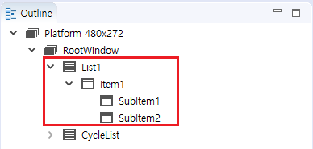

## <span id = "relation_function">컨트롤에 의해 자동으로 생성 된 상관 관계 함수에 대한 설명</span>
일부 컨트롤은 관련 함수를 자동으로 생성합니다. 이러한 컨트롤에 의해 생성 된 관련 함수에 대한 구체적인 설명은 다음과 같습니다. 

> [!Note]
> **함수에서`XXXX`는 컨트롤 ID를 나타내므로 실제 프로세스에서 직접 교체하십시오 **

---
* ### Button control
   ```c++
   static bool onButtonClick_XXXX(ZKButton *pButton) {
      return false;
   }
   ```
   버튼을 클릭하면 함수가 호출됩니다.
   
     * **파라미터 `ZKButton * pButton`**는 클릭 한 버튼의 포인터입니다. 포인터의 멤버 함수를 통해 컨트롤에 대해 일련의 작업을 수행 할 수 있습니다. 이 포인터는 전역 변수 `mXXXXPtr`이 가리키는 개체와 동일한 개체입니다.

---

* ### Edit Text control
  ```c++
  static void onEditTextChanged_XXXX(const std::string &text) {
    
  }
  ```
  
  Input box의 텍스트가 변경되면 시스템이 자동으로 이 함수를 호출합니다.
  
    * **파라미터 `std::string &text`** 현재 Input box의 전체 문자열입니다.

---

* ### Seek Bar control
  ```c++
  static void onProgressChanged_XXXX(ZKSeekBar *pSeekBar, int progress) {
  
  }
  ```

  Seek Bar의 현재 프로그래스 값이 변경되면 시스템이 자동으로 이 함수를 호출합니다.  
  * **파라미터`ZKSeekBar * pSeekBar`**는 Seek Bar 컨트롤의 포인터이며 포인터의 멤버 함수를 통해 컨트롤에서 일련의 작업을 수행 할 수 있습니다.
  * **파라미터 `int progress`**는 현재 Seek Bar의 프로그래스 값입니다.

---

* ### <span id = "slidewindow"> Slide Window control</span>
  ```c++
  static void onSlideItemClick_XXXX(ZKSlideWindow *pSlideWindow, int index) {
    
  }
  ```

  Slide Window 컨트롤에서 아이콘을 클릭하면 시스템이 자동으로 이 함수를 호출합니다.
  * **파라미터`ZKSlideWindow * pSlideWindow`**는 Slide Window 컨트롤의 포인터이며 포인터의 멤버 함수를 통해 컨트롤에 대해 일련의 작업을 수행 할 수 있습니다.
  * **파라미터`int index`**는 현재 클릭 된 아이콘의 Index 값입니다. 예를 들어 총 10 개의 아이콘이 Slide Window에 추가되었다면 Index 값의 범위는 [0, 9]입니다.

---

* ### <span id = "list">List control</span>
  List 컨트롤은 가장 복잡한 컨트롤이며 세 가지 관련 함수를 만듭니다. 많은 기능이 있지만 다음 단계에 따라 이해하기 매우 쉽습니다.    
  1. 첫째, 시스템이 List 컨트롤을 그리려면 얼마나 많은 항목이 있는지 알아야합니다. 따라서 다음과 같은 상관 함수가 있습니다.

    ```c++
      static int getListItemCount_XXXX(const ZKListView *pListView) {
            return 0;
      }
    ```

  * **파라미터`const ZKListView * pListView`**는 전역 변수`mXXXXPtr`과 동일한 개체를 가리키는 List 컨트롤의 포인터입니다.
  *  **리턴 값**은 정수로, List에있는 항목 수를 의미하며 필요에 따라 정의 할 수 있습니다.
    

  2. 시스템이 그려야 할 아이템의 수를 알아도 충분하지 않으며 각 항목에 대해 표시하는 내용도 알아야합니다. 이를 위해 아래 함수가 제공되고, 제공된 함수가 여러 번 호출되어 각 항목이 처리 될 때까지 각 항목의 표시 내용을 설정합니다.
    ```c++
     void obtainListItemData_XXXX(ZKListView *pListView, ZKListView::ZKListItem *pListItem, int index) {
      //pListItem->setText(index)
     }
    ```
    * **파라미터`ZKListView * pListView`**는 전역 변수 `mXXXXPtr`과 동일한 개체를 가리키는 List 컨트롤의 포인터입니다.
    * **파라미터`ZKListView :: ZKListItem * pListItem`**은 List Item의 포인터이며 UI 파일의 `Item`에 해당합니다.
    * **파라미터`int index`**는 전체 List에서 `pListItem`의 Index 값이며 특정 범위가 있습니다. **예 :**`getListItemCount_XXXX` 함수의 반환 값은 10이며 이는 List에 10 개의 Item이 있음을 의미합니다. 그러면`index`의 범위는`pListItem`과 `index`를 결합하여 [0, 9]입니다. 지금 설정 한 List Item이 전체 List에서 어디에 있는지 알 수 있습니다.
      이 기능에서는 `index`에 따라 각 List의 표시 내용을 개별적으로 설정할 수 있습니다.
      **예 :** 함수에서 주석 처리 된 문은 다음을 의미합니다. 각 List Item은 해당 Index 값을 텍스트로 표시합니다.

  

  3. Button 컨트롤과 마찬가지로 List 컨트롤에도 클릭 이벤트가 있지만 Index 값을 기준으로 현재 클릭 된 List Item을 판단합니다.
  ```c++
  static void onListItemClick_XXXX(ZKListView *pListView, int index, int id) {
        //LOGD(" onListItemClick_ Listview1  !!!\n");
  }
  ```
  List 컨트롤을 클릭하면 터치 좌표에 따라 터치 포인트가 어떤 List Item에 속하는지 시스템이 결정하고 List Item의 인덱스 번호를 계산 한 후 자동으로 이 함수를 호출합니다.

    * **파라미터`ZKListView * pListView`**는 전역 변수 `mXXXXPtr`과 동일한 개체를 가리키는 List 컨트롤의 포인터입니다.

    * **파라미터`int index`**는 전체 List 컨트롤에서 현재 클릭 된 List Item의 Index 값입니다.

    * **파라미터`int id`**는 현재 클릭 된 컨트롤의 ID입니다. 이 ID는 속성 창의 ID와 다릅니다. 이에 대한 매크로는 해당`Activity.h` 파일에 정의되어 있습니다. 예를 들어 `mainActivity.h`에서
      
      이 id의 기능은 List Item에 여러 subItem이 있을 때 현재 클릭 된 subItem을 구별하는 데 사용할 수 있다는 것입니다.
      **예 :** 아래 그림과 같이 List Item에 두 개의 subItem을 추가하고 스위치 버튼으로 그림을 추가했습니다. 속성 ID는 각각 `SubItem1` 및  `SubItem2`입니다. `SubItem1`을 클릭하면 `id`와 `ID_MAIN_SubItem1`, `ID_MAIN_SubItem2`의 관계를 판단하여 어떤 스위치를 클릭했는지 확인할 수 있습니다.

      예제 코드 :

   ```c++
     static void onListItemClick_XXXX(ZKListView *pListView, int index, int id) {
        //LOGD(" onListItemClick_ Listview1  !!!\n");
        switch(id) {
        case ID_MAIN_SubItem1:
            //LOGD("Clicked the first subitem of item %d in the list", index);
            break;
        case ID_MAIN_SubItem2:
            //LOGD("Clicked the second subitem of item %d in the list", index);
            break;
        }
    }
   ```
   
    
