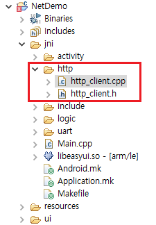

# 원격 업그레이드
 현재 시스템에는 직접 원격 업그레이드를위한 액티비티가 없습니다.
 그러나 우리는 TF 카드 감지 및 업그레이드 메커니즘을 이해하고 원격 업그레이드 목적을 달성하기 위해 자체 코드를 추가 할 수 있습니다.
 먼저 TF 카드를 삽입하는 일반적인 업그레이드 프로세스를 소개합니다.

## TF 카드 감지 업그레이드 프로세스
 시스템을 시작하거나 TF 카드를 삽입 할 때 [TF 카드가 정상적으로 장착되어있는 경우](tf.md) 시스템은 **TF 카드의 루트 디렉토리**에 **update.img** 파일이 있는지 확인합니다.(TF 카드의 루트 디렉토리는`/mnt/extsd`에 매핑됩니다.)
 파일이 있는 경우 파일이 요구 사항을 충족하는지 추가로 확인합니다. 확인을 통과하면 업그레이드 액티비티가 나타나고 사용자가 업그레이드를 선택할 수 있습니다.
 존재하지 않는 경우 프로세스가 종료되고 액티비티에는 어떤 행동도 일어나지 않습니다.

## 구현 단계
1. 먼저 업그레이드 이미지 `update.img`를 다운로드해야합니다.
    정상적인 상황에서는 HTTP 프로토콜을 통해 파일을 다운로드하는 것이 가장 쉬운 방법이며 실제 상황에 따라 다른 프로토콜을 선택할 수도 있습니다.
    다운로드 후 이미지 파일을 TF 카드 디렉토리`/mnt/extsd/`에 저장합니다.
  > [!Note]
  > 보드에 TF 카드가 삽입되어 있지 않은 경우에도이 디렉토리는 메모리에 저장되기 때문에 쓸 수 있습니다. 메모리 크기에 의해 제한되며 이미지 파일이 너무 크면 비정상적인 동작 또는 업그레이드 실패의 원인이됩니다.
  TF 카드를 삽입 한 경우 메모리 크기 문제를 무시할 수 있습니다.

2. 업그레이드 감지 함수 호출 
    먼저 [UpgradeMonitor.h](https://developer.flywizos.com/src/UpgradeMonitor.h) 소스 파일을 다운로드하여 프로젝트의`jni/include/os` 디렉토리에 저장합니다.

   

   그런 다음 함수를 호출하여 업그레이드를 감지하십시오.
   ```c++
   #include "os/UpgradeMonitor.h"
   ```
   ```c++
   //Actively detect whether there is a correct update.img file in the /mnt/extsd directory,
   //If yes, an upgrade prompt box will pop up
   //If not, nothing happens
   UpgradeMonitor::getInstance()->checkUpgradeFile("/mnt/extsd");
   ```
   업그레이드 액티비티가 나타나면 사용자가 업그레이드 여부를 선택할 수 있습니다.
   지금까지 원격 업그레이드 기능이 완전히 실현되었습니다.
   

## 파일 다운로드 후 자동 업데이트
 업그레이드 파일을 다운로드 한 후 강제로 업데이트하려면 [자동 업데이트](autoupgrade.md) 문서를 참조하여 코드로`zkautoupgrade` 파일을 생성하기 만하면됩니다.


## 반복적인 업그레이드 방지
 위 단계에서 이미지 파일을 `/mnt/extsd/`디렉토리에 저장합니다. 성공적으로 업그레이드하면 보드가 자동으로 다시 시작됩니다.
 이때 시스템은 정기적 인 업그레이드 감지 프로세스를 수행하며 이미지 파일이 존재하기 때문에 업그레이드 액티비티가 다시 팝업되어 업그레이드가 반복됩니다.

### 해결책
이미지 파일을 다운로드 할 때`/mnt/extsd/`가 아닌 다른 디렉토리에 저장하십시오. 예 :`/mnt/extsd/temp/`,
또한 감지 함수의 호출 시 파라미터도 수정합니다.

```c++
UpgradeMonitor::getInstance()->checkUpgradeFile("/mnt/extsd/temp");
```


## Sample
[Complete sample download](https://docs.flythings.cn/src/netupdate.zip)  
샘플은 단순히 http 클라이언트를 구현하여 파일을 다운로드합니다. 소스 코드의 http 부분을 참조하십시오.
파일 다운로드는 시간이 많이 걸리는 작업이므로 인터페이스의 즉각적인 응답에 영향을 주지 않도록 파일을 별도의 스레드에 배치하는 것이 좋습니다.

  
* 키 코드
  ```c++ 
    class DownloadThread : public Thread {
        protected:
        virtual bool threadLoop(){
            http::HttpClient http;
            mTextview1Ptr->setText("Download the upgrade file");
            //Create a save path for the upgrade file
            system("mkdir /mnt/extsd/temp");
            //Modify here to the real service IP
            string err = http.Download("192.168.1.1/update.img", 80, "/mnt/extsd/temp/update.img");
            mTextview1Ptr->setText(err);
            if (err.empty()) {
                UpgradeMonitor::getInstance()->checkUpgradeFile("/mnt/extsd/temp");
            }
            mButton1Ptr->setInvalid(false);
            return false;
        };
    };
  ```

* 서버 구현  
  테스트의 편의를 위해 예제에는 정적 파일 서비스 인`http.exe`가 포함되어 있습니다.
  
    
  
   만든 업그레이드 이미지 파일 `update.img`와 `http.exe`를 같은 폴더에 넣은 다음 `http.exe`를 더블 클릭하여 실행합니다. 네트워크가 정상이면 웹 사이트 미러 파일를 통해 같은 디렉토리에 파일을 다운로드 할 수 있습니다.
  
  예 :  
  http://192.168.1.1/update.img    
  (IP 주소를 컴퓨터의 현재 IP로 수정하십시오.)  

서버가 시작된 후 샘플 코드를 실행하여 원격 업그레이드를 테스트하십시오.
