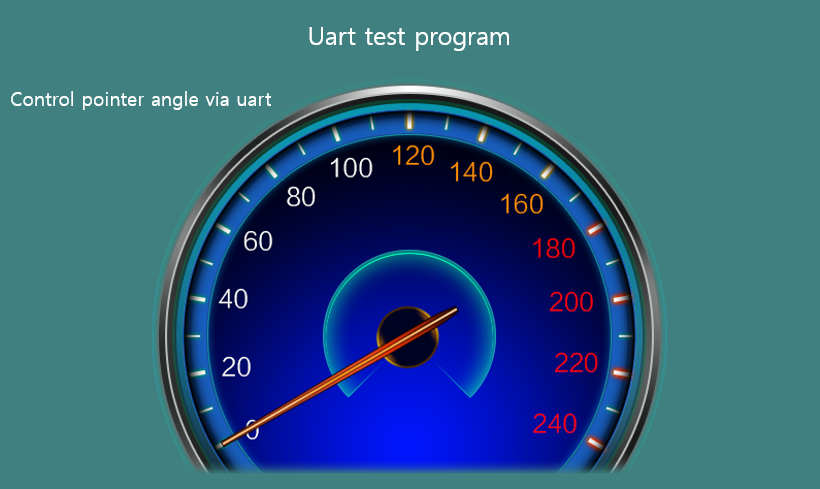

# 시리얼 통신 예제
여기서는 먼저 시리얼 통신의 주된 4가지 포인트를 살펴보겠습니다.

1. 데이터 수신
2. 데이터 분석
3. 데이터 디스플레이
4. 데이터 전송

**데이타 분석** 부분은 비교적 복잡하고, 특정 통신 프로토콜에 따라 변경되야 합니다. 이 장에서는 이론적인 내용에 대해 이야기하지 않고, 몇 가지 실제 사례를 제공합니다. 

## 사례 1 
여기서 우리는 이전에 구현했던 간단한 통신 프로그램을 예로 들어보겠습니다. 완전한 코드는 [Sample Code](demo_download.md#demo_download)의 `UartDemo` 프로젝트에서 확인할 수 있습니다. 달성하고자하는 최종 효과는 디스플레이에서 미터기의 회전을 제어하기 위해 시리얼 포트를 통해 명령을 보내는 것입니다.  
UI 렌더링은 다음과 같습니다.



미터기의 회전을 제어하려면 기존 코드 중 **세 곳**만 수정하면됩니다.

**1)** 앞서 소개 한 프로토콜 형식을 다시 살펴보고 여기에 **0x0001**값에 해당하는 자체 프로토콜 명령 **CMDID_ANGLE**을 추가합니다. 

| Protocol header(2bytes) | Command(2bytes) | length of data(1byte) | data(N) | checksum(1byte option) |
| --- | --- | --- | --- | --- |
| 0xFF55 | 0x0001（See below`CMDID_ANGLE`） | 1 | angle | checksum |

프로토콜 데이터 구조에 1개의 변수를 추가합니다. `ProtocolData.h`를 참조하십시오.

```c++
/******************** CmdID ***********************/
#define CMDID_POWER			0x0
#define CMDID_ANGLE			0x1	// new command ID
/**************************************************/

typedef struct {
	BYTE power;
	BYTE angle;	// Added variable to save pointer angle value
} SProtocolData;
```
**2)** 이전에 정의된 프로토콜 형식을 계속 사용하고 있어 프로토콜 구문 분석 부분을 변경할 필요가 없습니다. `procParse`에서 해당 CmdID 값만 처리하면 됩니다.

```c++
/**
 * Parse each frame of data
 */
static void procParse(const BYTE *pData, UINT len) {
	// CmdID
	switch (MAKEWORD(pData[3], pData[2])) {
	case CMDID_POWER:
		sProtocolData.power = pData[5];
		break;

	case CMDID_ANGLE:	// New part, save angle value
		sProtocolData.angle = pData[5];
		break;
	}

	// Notify protocol data update
	notifyProtocolDataUpdate(sProtocolData);
}
```
**3)** 프로토콜 데이터를 수신하는 액티비티의 콜백 함수를 살펴 보겠습니다. logic/mainLogic.cc를 참조하십시오.

```c++
static void onProtocolDataUpdate(const SProtocolData &data) {
	// Serial data callback function

	// Set the rotation angle of the pointer
	mPointer1Ptr->setTargetAngle(data.angle);
}
```
위의 과정을 완료 한 후 MCU를 통해 해당 명령을 보드에 전송하면 미터기가 회전하는 것을 볼 수 있습니다. 간단하게 구현하기 위해 이 프로그램에서는 첵섬 확인을 수행하지 않으며 프로토콜 데이터는 다음과 같습니다.
```
protocol header     CmdID     length of data    angle data
0xFF 0x55         0x00 0x01        0x01            angle
```
CommDef.h 파일에서 `DEBUG_PRO_DATA`매크로를 열고 수신 된 프로토콜 데이터를 출력할 수 있습니다.


이 시점에서 시리얼 포트는 **데이터 수신** ---> **데이터 분석** ---> **데이터 표시**로 하나의 커맨드에 대한 처리가 완성되었습니다.
마지막으로 시리얼 포트 **데이터 전송**을 시뮬레이션해 보겠습니다. 제공하는 프로그램에서 타이머가 실행되고 데이터 전송이 2초마다 시뮬레이션됩니다.

```c++
static bool onUI_Timer(int id) {
	// Simulate sending serial data
	BYTE data = rand() % 200;
	sendProtocol(CMDID_ANGLE, &data, 1);

	return true;
}
```
위의 코드는 실제 각도 값 설정을 시뮬레이션하기 위한 것입니다. 보드에서 통신 시리얼 포트의 TX와 RX를 단락시켜 **자발 송수신**을 구현할 수 있으며, 미터기가 회전하는 것을 볼 수 있습니다.
여기까지 시리얼 포트 데모 프로그램 소개가 완료되었습니다. 개발자는 데모 프로그램을 컴파일하고 보드에 레코딩하여 효과를 확인할 수 있습니다. 그런 다음 이를 기반으로 몇 가지 프로토콜을 추가하여 테스트하고 전체 통신 프로세스에 익숙해집시다.