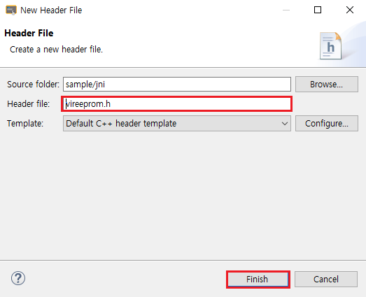

# EEPROM 기능 에뮬레이션

 EEPROM (전원이 공급되는 동안 읽기-쓰기 가능한 메모리)은 사용자가 변경할 수 있는 메모리(ROM)로, 정상보다 높은 전압으로 삭제 및 재 프로그래밍 (다시 쓰기)을 할 수 있습니다.

## 에뮬레이션 원리

 이 시스템은 자체 파일 시스템이 있는 Linux 기반으로 저장된 데이터를 **NorFlash**에 기록합니다 (삭제 횟수가 100,000 회 이상, **Nandfalsh**가 아닙니다. **NandFlash**는 불량 블록이 나타난 후 다양한 위험이 발생할 수 있습니다).
 **/data ** 파티션은 사용자 데이터를 위해 FlywizOS 내부에 예약되어 있습니다. 마이크로 컨트롤러 작동에 익숙한 사용자의 편의를 위해 **/data ** 파티션 아래에 파일을 생성하여 EEPROM 공간을 시뮬레이션합니다.(/data 파티션의 크기는 특정 시스템 버전에 따라 1M 또는 수백 KB 범위)  

## 사용 시나리오

전원이 꺼진 상태에서 데이터를 유지하십시오.

## 구현 단계

1. 먼저 프로젝트의 **jni** 디렉토리에 헤더 파일을 만듭니다.  
   프로젝트에서 **jni**를 선택하고 마우스 오른쪽 버튼을 클릭 한 다음 팝업 컨텍스트 메뉴에서 **New -> Header File** 옵션을 선택한 다음 이름을 **vireeprom.h**로 지정하고 Finish를 클릭합니다.   
    
    

2. 방금 추가 한 헤더 파일에 다음 코드를 복사합니다. (헤더 파일 생성 시 일부 내용이 자동으로 추가 및 삭제 될 수 있습니다.)
   이 코드는 EEPROM의 에뮬레이션 기능을 구현합니다.
   ```c++
   #ifndef JNI_VIREEPROM_H_
   #define JNI_VIREEPROM_H_
     
   #include <stdio.h>
   #include <string.h>
   #include <unistd.h>
   /**
    * The storage size of the emulated EEPROM, in bytes, it is recommended not to be too large
    */
   #define EEPROM_SIZE 1024
   /**
    * Actually saved as a file /data/eeprom.eep
    */
   #define EEPROM_FILE  "/data/eeprom.eep"
   
   class VirEEPROM {
   
   public:
     VirEEPROM() {
       memset(buff_, 0, sizeof(buff_));
       file_ = fopen(EEPROM_FILE, "rb+");
       if (file_) {
         fread(buff_, 1, EEPROM_SIZE, file_);
         fseek(file_, 0, SEEK_END);
         int f_size = ftell(file_);
         //Adjust the file to a suitable size
         if (f_size != sizeof(buff_)) {
           ftruncate(fileno(file_), sizeof(buff_));
           fseek(file_, 0, SEEK_SET);
           fwrite(buff_, 1, sizeof(buff_), file_);
           fflush(file_);
           sync();
         }
       } else {
         file_ = fopen(EEPROM_FILE, "wb+");
         //Adjust the file to a suitable size
         ftruncate(fileno(file_), sizeof(buff_));
       }
     }
     virtual ~VirEEPROM() {
       if (file_) {
         fflush(file_);
         fclose(file_);
         sync();
       }
     }
     /**
      * Return : less than 0 is failure, greater than 0 is the actual number of bytes written
      * Parameter: The data pointer that value needs to save, which can be a structure pointer, char*, int*..., size is the
      * size of the data to be saved
      * Examples of use:
      * const char buff[]="12345678";
      * VIREEPROM->WriteEEPROM(0,buff,sizeof(buff);
      */
     int Write(int addr, const void* value, int size) {
       if (file_ == NULL) {
         return -1;
       }
       if ((addr >= EEPROM_SIZE) || ((addr + size) > EEPROM_SIZE)) {
         //Oversize
         return -2;
       }
       memcpy(buff_ + addr, value, size);
       if (0 != fseek(file_, addr, SEEK_SET)) {
         return -3;
       }
       int n = fwrite((char*)value, 1, size, file_);
       fflush(file_);
       sync();
       return n;
     }
     /**
      * Return : less than 0 is a failure, greater than 0 is the number of bytes actually read
      * Parameter: the data pointer to be read by value, which can be a structure pointer, char*, int*..., size is the size of
      * the data to be read
      * Examples of use:
      * char buff[9];
      * VIREEPROM->ReadEEPROM(0,buff,sizeof(buff);
      */
     int Read(int addr,void* value,int size) {
       if (file_ == NULL) {
         return -1;
       }
       if ((addr >= EEPROM_SIZE) || ((addr + size) > EEPROM_SIZE)) {
         //Oversize
         return -2;
       }
       memcpy(value, buff_ + addr, size);
       return size;
     }
     /**
      * Return：
      *     0    Success
      *     Less than 0 failed
      */
     int Erase() {
       if (file_ == NULL) {
         return -1;
       }
       if (0 != fseek(file_, 0, SEEK_SET)) {
         return -2;
       }
       memset(buff_, 0, sizeof(buff_));
       if (sizeof(buff_) != fwrite(buff_, 1, sizeof(buff_), file_)) {
         return -3;
       }
       fflush(file_);
    sync();
       return 0;
     }
      
     static VirEEPROM* getInstance() {
       static VirEEPROM singleton;
       return &singleton;
     }
   private:
   unsigned char buff_[EEPROM_SIZE];
      FILE* file_;
    };
    #define VIREEPROM  VirEEPROM::getInstance()
   
    #endif /* JNI_VIREEPROM_H_ */
    
   ```   
3. 지금까지 준비 작업이 완료되었으므로 정상인지 테스트하기 위해 몇 가지 예제를 작성하겠습니다.
   `mainLogic.cc` 소스 파일을 열고 파일 맨 위에있는 "**vireeprom.h**" 헤더 파일을 인용하십시오.
    ```c++
    #include "vireeprom.h"
    ```
   
4. Test code   
    ```c++
    static void onUI_init(){
        //The value array, starting from address 0, is written sequentially
        char value[4] = {1, 2, 3, 4};
        VIREEPROM->Write(0, value, sizeof(value));

        //Start reading from address 0, read 4 bytes in sequence, and save the read content in buf
        char buf[4] = {0};
        VIREEPROM->Read(0, buf, sizeof(buf));
        //Output log
        LOGD("Data read : %02x, %02x, %02x, %02x", buf[0], buf[1], buf[2], buf[3]);
      
        //Clear all eeprom to 0
        VIREEPROM->Erase();
    }
    ```

   
