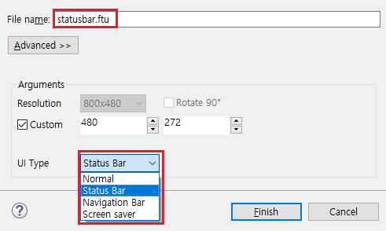

# 시스템 액티비티
  IDE를 통해 새로운 UI 파일을 만들 때 기본 UI 유형은 **Normal**이며, 일반적인 상황에서는 충분합니다.

 

 일부 장면에서 UI 액티비티 위에 떠있는 디스플레이 영역이 필요한 경우 **Normal** UI파일은 작업을 수행 할 수 없으며 다른 여러 유형의 UI파일을 사용해야합니다.
 **UI Type** 옵션에는 세 가지 특수 유형의 옵션이 있습니다. 이 세 가지 특수 유형에는 다음에 해당하는 특수 파일 이름이 있습니다.

* **statusbar.ftu**
* **navibar.ftu**
* **screensaver.ftu**  

  

확인을 클릭하면 IDE가 자동으로 해당 코드를 생성합니다. 이 세 가지 유형의 액티비티의 작업은 일반 액티비티의 작업과 동일합니다.

## Status bar
 설명 : 이 Status bar는 Android 및 iOS 휴대폰의 상태 표시 줄과 동일한 개념으로 UI 위에 떠있는 일반 표시 영역입니다. 일반적으로 몇 가지 공통 정보를 표시하거나 복귀 버튼 또는 홈 버튼 등을 배치하는 데 사용됩니다. 


시스템은 Status bar을 작동하는 데 사용할 수 있는 두 가지 인터페이스를 제공합니다.
Show status bar：

```c++
EASYUICONTEXT->showStatusBar();
```
Hide status bar：
```c++
EASYUICONTEXT->hideStatusBar();
```
전체 코든는 [**Sample Code**](demo_download.md#demo_download)의 **StatusBarDemo** 프로젝트를 참고하십시오.

## Navigation bar
 설명 :이 Navigation bar는 안드로이드 폰의 Navigation bar와 동일한 개념을 가지고 있으며, 일반적으로 페이지 하단에 있는 UI 위에 떠있는 일반 작업 또는 표시 영역입니다. 일반적으로 일부 조작 키를 표시하는 데 사용됩니다. Navigation bar은 실제로 Status bar과 다르지 않습니다.

Show navigation bar：
```c++
EASYUICONTEXT->showNaviBar();
```
Hide navigation bar：
```c++
EASYUICONTEXT->hideNaviBar();
```

## Screensaver
 설명 : Screensaver 어플리케이션은 사용자가 정해진 시간동안 시스템과 상호 작용하지 않을 때 시스템이 자동으로 페이지를 엽니다.
 프로젝트를 마우스 오른쪽 버튼으로 클릭하고 속성 옵션을 선택합니다. 팝업 속성 상자에서 화면 보호기 초과 시간을 초 단위로 설정할 수 있습니다. -1은 화면 보호기가 없음을 의미합니다.
 코드를 통해 몇 가지 설정을 할 수도 있습니다. jni/include/entry/EasyUIContext.h를 참조하십시오.

* 필요한 헤더 파일
 ```c++
 #include "entry/EasyUIContext.h"
 ```

* Screensaver timeout 시간 설정
```c++
//Set the screensaver timeout time to 5 seconds
EASYUICONTEXT->setScreensaverTimeOut(5); 
```

* Screensaver 허용 여부 설정

  ```c++
  EASYUICONTEXT->setScreensaverEnable(false); //Turn off screensaver detection
  EASYUICONTEXT->setScreensaverEnable(true); //Turn on screensaver detection
  ```
  > Application scenario: If the upgrade interface cannot enter the screensaver mode, you can turn off the screensaver detection in the upgrade application EASYUICONTEXT->setScreensaverEnable(false).
  
* Screensaver 실행
```c++
EASYUICONTEXT->screensaverOn();
```

* Screensaver 종료
```c++
EASYUICONTEXT->screensaverOff();
```

* 현재 Screensaver가 동작중인지 확인
```c++
EASYUICONTEXT->isScreensaverOn();
```

더 자세한 내용은 [**Sample Code**](demo_download.md#demo_download)의 **ScreensaverDemo** 프로젝트를 참고하십시오.
