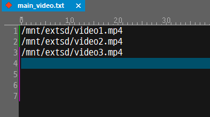

# Video view
FlywizOS는 동영상 재생을 위한 컨트롤도 제공합니다.

> [!Note]
> 동영상 재생 기능은 모든 버전의 기기에서 지원되지 않습니다! 이 기능을 정상적으로 사용하려면 멀티미디어 기능이 있는 버전을 구입하세요.

## 컨트롤의 Loop 속성 사용법
1. 먼저 **Video View** 컨트롤을 만듭니다. 기본 배경색은 검은 색입니다.

2. **Video view** 의 속성 창을 확인합니다.

     

    그 중 하나의 속성으로 **Loop** 가 있습니다.
    해당 속성을 **Yes**로 선택하면 이 UI 액티비티에 들어갈 때마다 자동으로 TF 카드 디렉토리의 구성 파일을 읽고 파일에 지정된 동영상를 반복 재생합니다. 액티비티를 종료하면 자동으로 재생을 중지합니다. 이 속성은 광고 장치와 같이 짧은 동영상의 자동 재생 등, 사용자의 개입없이 동영상 만 재생해야하는 장치에 매우 적합합니다.
    **No**를 선택하면 동영상의 렌더링 영역 만 생성되고 다른 작업은 수행되지 않습니다. 그 후 직접 조작하여 동영상를 재생해야 합니다.

3. 동영상 구성 파일 만들기
  위에서 언급했듯이 **Loop**가 **Yes**인 경우 동영상 구성 파일을 자동으로 읽습니다.(파일은 직접 만들어야 합니다.)
  이 구성 파일은 TF 카드의 루트 디렉토리에 있어야 하고 파일 이름은 **XXXX_video_list.txt**입니다.
  XXXX는 해당 UI 파일 이름을 나타냅니다. 예 : **main.ftu**에 Video View 컨트롤을 추가하면 해당 구성 파일 이름은 **main_video_list.txt **입니다.
  구성 파일은 라인 단위이며 각 라인은 동영상 파일의 절대 경로입니다. 동영상 파일이 TF 카드의 루트 디렉토리에 있는 경우`/mnt/extsd/`를 입력하고 동영상 파일 이름을 추가하면 됩니다.

  

  **Note : 파일 이름 인코딩 문제로 인한 동영상 파일 읽기 실패를 방지하려면 동영상 파일 이름을 영어로 지정하십시오.**
4. 프로그램이 실행 된 후 구성 파일의 동영상를 자동으로 반복 재생 할 수 있습니다.

## 지정된 동영상 파일 재생
1. **Video View** 컨트롤을 만듭니다.
2. `Loop`를 No로 설정합니다.
3. 재생을 제어하는 코드 추가합니다.

Play

  ```c++
  //Play the test.mp4 file, starting from time 0
  mVideoView1Ptr->play("/mnt/extsd/test.mp4", 0);
  ```
  Pause
  ```c++
  //Pause playback
  mVideoView1Ptr->pause();
  ```
  Resume
  ```c++
  //Resume playback
  mVideoView1Ptr->resume();
  ```
  Stop
  ```c++
  mVideoView1Ptr->stop();
  ```
  특정 시간으로 이동 후 플레이
  ```c++
  //Jump to the 10 second position
  mVideoView1Ptr->seekTo(10 * 1000);
  ```
  재생 볼륨 설정, 범위 0 ~ 1.0
  ```c++
  //Set the volume to 0.5
  mVideoView1Ptr->setVolume(0.5);
  ```
  재생 중인지 확인
  ```c++
  bool state = mVideoView1Ptr->isPlaying();
  if （state) {
    LOGD("Now Playing");
  }
  ```
  동영상의 총 길이(ms)를 가져옵니다.
  ```c++
  int n = mVideoView1Ptr->getDuration();
  ```

  동영상의 현재 재생 위치를 ms단위로 가져옵니다.
  ```c++
  int n = mVideoView1Ptr->getCurrentPosition();
  ```

  동영상은 비동기 적으로 재생되며 자동으로 생성 된 관련 기능이 동영상 재생 상태를 알려줍니다.

  ```c++
    static void onVideoViewPlayerMessageListener_VideoView1(ZKVideoView *pVideoView, int msg) {
        switch (msg) {
        case ZKVideoView::E_MSGTYPE_VIDEO_PLAY_STARTED:
          LOGD("Start playback");
            break;
        case ZKVideoView::E_MSGTYPE_VIDEO_PLAY_COMPLETED:
          LOGD("End playback");
            break;
        case ZKVideoView::E_MSGTYPE_VIDEO_PLAY_ERROR:
          LOGD("Error");
            break;
        }
    }
  ```

## 완전한 동영상 플레이어 구현
 동영상 재생에 대한 더 높은 요구 사항이 있는 경우 재생/일시 중지 및 현재 재생 시간 등을 조작할 수 있서야 합니다. 
[전체 동영상 플레이어 샘플(계속)]()을 참조하세요.

## Sample code
더 자세한 내용은 [Sample Code](demo_download.md#demo_download)의 VideDemo 프로젝트를 참고하십시오.

 