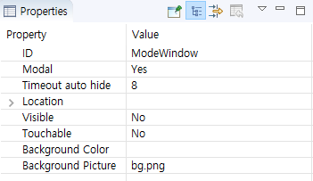

# Window
## 기능 설명
Window는 실제로 컨테이너이며 모든 컨트롤을 포함하거나 새 Window를 다시 포함 할 수 있고 다음과 같은 시나리오에서 사용할 수 있습니다.

* 컨트롤 조합 표시 및 숨기기
* 탭 페이지를 완성해야 할 때 여러 Window를 통해 다른 Window 사이를 전환 할 수 있습니다.
* 팝업 대화 상자

## 사용법
1. **Window** 컨트롤을 만듭니다. 기본 Window는 투명합니다. 배경 이미지를 추가하거나 필요에 따라 배경색을 수정할 수 있으며 Window에 다른 컨트롤을 추가 할 수도 있습니다.

   
2. 위의 속성 창에는 설명해야 할 두 가지 속성이 있습니다.
  * **Modal**  
    모달인 경우 이 Window 컨트롤이 표시 될 때 Window 바깥 쪽을 클릭하면 창이 자동으로 숨겨집니다.
    모달이 아닌 경우 창 컨트롤의 표시/숨기기를 자체적으로 제어해야 합니다.
  * **Timeout auto hide**  
    모달 Window인 경우 Window는 표시 시작부터 계산을 시작하고 지정된 시간이 지나면 자동으로 숨겨집니다. 단위는 초이며 값이 -1이면 자동으로 숨겨지지 않음을 의미합니다.
    모달이 아닌 경우이 속성은 효과가 없습니다.

## 코드 조작
Window 컨트롤의 경우 일반적으로 다음 함수가 포함됩니다.
```C++
//Show window
void showWnd();
//Hide window
void hideWnd();
//Determine whether the window is displayed
bool isWndShow();
```

## 동적으로 배경 설정
화면 전체에 Window를 펼친 다음 이 Window의 배경을 설정하면 화면 배경을 수정하는 효과를 얻을 수 있습니다.

* 관련된 함수
  ```c++
	/**
	 * @brief Set background picture
	 * @param pPicPath Picture path
	 */
	void setBackgroundPic(const char *pPicPath);

	/**
	 * @brief Set background color
	 * @param color When -1, the background is set to transparent; other color values are 0xRGB, and the color value does not 
	 * support alpha
	 */
  void setBackgroundColor(int color);
  ```
  
* 사용 예제
  ```c++
	//Set the image of the path /mnt/extsd/bg.png as the background image of this window control
	mWindow1Ptr->setBackgroundPic("/mnt/extsd/bg.png");
	
	//Set the background color of the window with ID window1 to red
	mWindow1Ptr->setBackgroundColor(0xff0000);
    
  //Set the background color of the window with ID window1 to green
	mWindow1Ptr->setBackgroundColor(0x00ff00);
        
  //Set the background color of the window with ID window1 to blue
	mWindow1Ptr->setBackgroundColor(0x0000ff);
	```
	
	많은 컨트롤에는 배경색 및 배경 이미지를 설정하는 인터페이스가 있으며 방법은 동일합니다.
	

# Sample code
 

더 자세한 내용은 [Sample Code](demo_download.md#demo_download)의 WindowDemo 프로젝트를 참고하십시오.